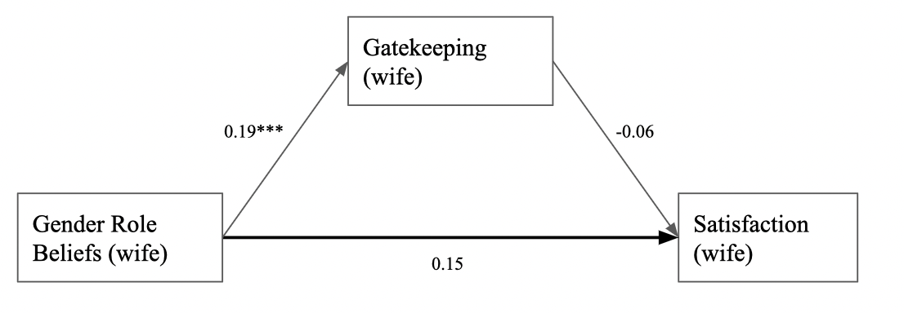

```{r setup, include = FALSE}
library("papaja")
library(tidyverse)
library(nlme)
library(dplyr)
library(ggplot2)
library(rstatix)
library(bda)
library(psych)
library(lubridate)
r_refs("r-references.bib")

```

```{r analysis-preferences}
# Seed for random number generation
set.seed(42)
knitr::opts_chunk$set(cache.extra = knitr::rand_seed)
```

# Housework distribution and satisfaction: The moderating role of gender role beliefs and religion
## Introduction

Gender role beliefs have been widely debated in society for decades, as this controversial concept subjects men and women to gender-specific roles. One audible voice in this discourse is the voice of the Church. Pope Francis, for example, recently described gender theory as evil and dangerous because “[i]t would make everything homogeneous, neutral. It is an attack on difference, on the creativity of God and on men and women” [@catholic_league_pope_2020]. 

Traditionally, the majority of housework has been done by women while their male partners have been involved with paid labor. This distinction of gendered labor has been subject to change over the past few decades. Although most women in heterosexual couples are now as equally involved in paid labor as their male counterparts are, they often still do the majority of the housework [@forste_fox_2008; @leopold_2019; @mikula_199]. These evolving trends illustrate how traditional and conservative gender role beliefs are slowly becoming more liberal and less stringent in everyday life. Gender role beliefs still heavily influence women's role in society, from their job prospects to gender-based income inequalities. Even though men are now doing more housework than before the “gender revolution” [@goldschneider_2014], the unequal distribution of housework has been found to result in lower satisfaction levels in female partners [@leopold_2019]. However, since past research [@forste_fox_2012; @baxter_western_1998] has shown that this relationship between housework distribution and satisfaction is complex, we will assess the extent to which two variables, religion and gender role beliefs, strengthen or dampen this relationship. 
This will be done using a dyadic approach. The dyadic approach has the advantage of including interactions between partners and therefore gets to the core of the relationships of interest which has not been the standard approach in prior research. This approach will strengthen this study by specifying the effects of each partner’s gender role beliefs and religion on the relationship between housework distribution and satisfaction.
This research topic is important to investigate as it can help prevent future relationship conflicts and housework-related stress, which could impact negative health outcomes such as depressive symptoms, as well as divorce rates [@bird_99, @glass_fujimoto_94; @ruppanner_2012].
 
Numerous past studies have analyzed the growing relationship between housework distribution and satisfaction. @nelson_1977 found that almost half of the housewives in the sample were intrinsically satisfied, but did not explain why the satisfaction differed. These findings are specifically related to housework tasks that are perceived as “female-typed”, which include everyday chores such as laundry and cleaning. In most articles, the “female-typed” housework tasks were seen as prototypical housework tasks that significantly affected satisfaction levels [@benin_agostinelli_1988; @ellison_bartkowski_2002]. Using data from the late 1900s, @baxter_western_1998 found that regardless of an extremely uneven distribution of housework labor, only 13-14% of women were dissatisfied. In contrast, @mikula_1997 concluded that women who did more housework than men were significantly less satisfied. Their partners who performed less housework showed higher satisfaction levels. 
These rather contradictory findings could be explained by the aforementioned societal changes concerning gender role beliefs and the “gender revolution” that can change one’s judgment and satisfaction with housework distribution [@goldschneider_2014; @okulicz_valente_2018]. This is in line with more recent studies that found that women were more unsatisfied with the housework distribution than men and that equal housework distribution was related to subjective marital equity [@charbonneau_2019; @spitze_loscocco_2000]. Therefore, it is not appropriate to assume that an equal distribution of housework labor is the only predictor of satisfaction. 
It therefore seems important to consider the personal perception concerning housework. Greater underbenefit, the act of one partner doing more housework than the other resulting in negative emotions, has been shown to relate to lower marital quality [@demaris_2010]. This notion of underbenefit contradicts past research in which female partners evaluated their uneven housework distribution in a positive way, which points us towards the importance of subjectivity and the personal standard with which each situation is assessed. One way in which individuals differed that addresses these subjective standards is gender role beliefs. @buunk_2000 showed that egalitarian women tended to be more dissatisfied with an unequal distribution of housework in comparison to traditional women. Likewise, @evertson_2014 reported that people who held egalitarian gender role beliefs were more satisfied with a more equal distribution of housework. For egalitarian couples, it was observed that housework was more equally distributed, while in households that held traditional views women still did the majority of the housework [@greenstein_1996]. This shows that couples strived towards a distribution of housework that satisfied them [@benin_agostinelli_1988], but this balance looked different for everyone. Researchers found the highest satisfaction levels in traditional couples when both partners had varying involvements in household tasks and the subjective incongruence between attitudes and behaviors regarding family roles was low [@forste_fox_2012]. This means that partners were satisfied when they valued equality on a cognitive level and had an actual equal distribution of housework at home. It is therefore necessary to assess the effect of gender role beliefs on the relationship between housework distribution and satisfaction, as prior research suggested that this relationship could be reversed when comparing traditional and egalitarian couples.  

While most studies focused on female contributions to housework and its impact on satisfaction, some studies also looked at male partners. It was found that men who were married to women with traditional views performed less housework than men who were married to women with egalitarian views [@greenstein_1996]. These men who did less housework were found to have greater satisfaction. This illustrates how gender role beliefs moderate the relationship between housework distribution and satisfaction since the men who were married to women with higher gender role beliefs (traditional women) performed less housework and were, therefore, more satisfied. This unequal housework distribution can have severe health consequences, as a greater housework distribution has been associated with higher levels of depression [@glass_fujimoto_94]. Since prior research only focused on either the male or female partner, it did not provide a dyadic analysis of couples. This led to incomplete results which did not reveal all the information needed to fully understand the underlying dynamics between these variables. Therefore, we will use a dyadic approach to assess this relationship.

Another way through which individuals might differ that also moderates the relationship between housework distribution and satisfaction is religion. Religion has been an important factor in relationship dynamics for decades. It provides a powerful framework for gender norms and beliefs that are sanctified and therefore qualitatively different from non-religious norms [@hunt_jung_2009]. For most religious denominations, religiosity is connected to patriarchal gender role attitudes at home [@goldschneider_2014]. As shown in the quote by Pope Francis, religion and religious institutions are still powerful societal actors that influence intrinsic values and beliefs to this day [@musek_2017]. Religion and varying gender beliefs continue to heavily impact the expectations of female and male responsibilities and the distribution of housework roles between heterosexual, religious couples. Research has shown that conservative gender role models were more commonly implemented if one partner strongly believed in religious gender stereotypes [@blair_lichter_1999]. Females’ beliefs greatly influenced the distribution of household labor and housework patterns [@ellison_bartkowski_2002]. While conservative evangelical women invested more time in housework in general and specifically in female-typed housework, the husband’s religious affiliation did not affect the amount of housework as much. @ellison_bartkowski_2002 explained this by hegemonic masculinity superseding subcultural gender norms.  However, while many religious couples have started to defy this dynamic, some still continue to follow this structure. Not only does religion affect the distribution of housework, but prior research has also suggested that in religious couples, a small contribution towards housework from men was found to lead to higher female partner satisfaction [@demaris_2013]. Both @gull_geist_2020 and @ellison_bartkowski_2002 concluded religion to be a moderator of the relationship between the amount of housework a wife performs, and the type of housework religious men engage in. Evangelical women invested more time in housework in general and specifically in female-typed housework, while the husband’s religious affiliation did not affect the amount of housework which the authors explained by hegemonic masculinity superceding subcultural gender norms [@ellison_bartkowski_2002]. It will be interesting to investigate whether these patterns found 20 years ago, are still in place.  It amplifies this relationship … Although previous studies have suggested that religion is related to housework distribution, the moderating impact of religion on the relationship between housework distribution and satisfaction has not been sufficiently investigated from both partners' perspectives. Once again, most studies have lacked a dyadic approach as they either focused on either the male partner or the female partner, which increases the need to perform a dyadic analysis. It is especially interesting to analyze these relationships further in a dyadic way as men’s and women’s relationship patterns between housework distribution, satisfaction, and religion could look very different. Because the religious landscape as well as overall societal structures, including hegemonic masculinity, are currently subject to societal change, it will be interesting to see whether patterns might have changed during the last years and therefore differ from previous findings.


In our study, we examined the relationship between housework distribution and satisfaction in a way past research has not done yet. This included a dyadic investigation of the impact of the moderating factors of gender role beliefs and religion on housework distribution and satisfaction of both partners. We more specifically aim to find out whether the relationship between housework distribution and satisfaction is moderated by gender role beliefs and religion, and whether gender-related characteristics affect one’s own (actor effects) and the partner’s outcomes (partner effects). 
We hypothesize that the higher the amount of housework of an egalitarian partner, the lower the satisfaction is for an unequal housework distribution (Hypothesis 1a). For women with traditional gender role beliefs, a higher amount of housework is associated with a higher level of satisfaction than liberal women (Hypothesis 1b). Male partners with traditional gender role beliefs are expected to be more satisfied if their wives did more housework (Hypothesis 1c). Because prior research lacks dyadic analyses, specifying the effects of each partner’s gender role beliefs on the relationship of interest will strengthen the current study. Similar to the moderating role of gender role beliefs, it is expected that because religion is connected to more traditional relationship ideals, it can be another moderator for the relationship between housework distribution and satisfaction. It is hypothesized that in non-religious couples, more housework is related to lower satisfaction with housework distribution (Hypothesis 2a). For religious women, it is expected that more housework is connected to greater satisfaction (Hypothesis 2b) and religious male partners are expected to be more satisfied if their wife does more housework (Hypothesis 2c). 

Besides the hypothesized relationships described above, we will include exploratory analysis of gatekeeping behaviors within the couples. Gatekeeping is defined as behaviors that prevent equal work performed by both partners in a relationship [@hawkins_1999]. According to @hawkins_1999, a mother's reluctance to share familial responsibility inhibits greater father involvement in family work, resulting in an unequal housework distribution. We will investigate whether gatekeeping in females is related to gender role beliefs and therefore mediates the relationship between gender role beliefshousework distribution and satisfaction. Gatekeeping behaviors by one partner can shut out the other partner from performing a household task. 

```{r, include = FALSE}
dat_reverse <- read.csv("dat_reverse.csv")
dat_predyad <- read.csv("predyaddata.csv")
dat_dyad <- read.csv("dyadic.csv")
dat <- read.csv("TeleCom_Dyad_premeasures.csv")
```

```{r, include = FALSE}
#dataset complete and cleaned
head(dat)
n2 <- count(dat)
n2

n <-length(which(dat_reverse$gender==0))
n
n_indiv <- n*2
n_indiv
```

```{r, include = FALSE}
#create women and men dataset 
dat_reverse_w <- subset(dat_reverse, gender==0)
dat_reverse_m <- subset(dat_reverse, gender==1)

#age 
mean(dat_reverse$age)
meanage<-tapply(dat_reverse$age, dat_reverse$gender, mean)
womenmean <- meanage[2]
menmean <- meanage[1]

sdage<-tapply(dat_reverse$age, dat_reverse$gender, sd)
womensd <- sdage[2]
mensd <- sdage[1]

womenrange <- range(dat_reverse_w$age)
womenrangelow <- womenrange[1]
womenrangelow
womenrangehigh <- womenrange[2]
womenrangehigh

menrange <- range(dat_reverse_m$age)
menrangelow <- menrange[1]
menrangelow
menrangehigh <- menrange[2]
menrangehigh
```

```{r relationship_lengt, include = FALSE}
#relationship length
lengthmean <- round(mean(dat_reverse$relation_yrs, na.rm = TRUE),2)
lengthsd <- round(sd(dat_reverse$relation_yrs, na.rm = TRUE),2)
lengthrange <- range(dat_reverse$relation_yrs, na.rm = TRUE)
lengthrangelow <- round(lengthrange[1],2)
lengthrangehigh <- round(lengthrange[2],2)
``` 

```{r income, include = FALSE}
#income
meninc <- range(dat_reverse_m$indinc, na.rm=TRUE)
meninclow <- meninc[1]
meninclow
meninchigh <- meninc[2]
meninchigh

menincmean <- round(mean(dat_reverse_m$indinc, na.rm=TRUE))

menincsd <- round(sd(dat_reverse_m$indinc, na.rm=TRUE))


womeninc <- range(dat_reverse_w$indinc, na.rm=TRUE)
womeninclow <- womeninc[1]
womeninclow
womeninchigh <- womeninc[2]
womeninchigh

womenincmean <- round(mean(dat_reverse_w$indinc, na.rm=TRUE))

womenincsd <- round(sd(dat_reverse_w$indinc, na.rm=TRUE))
```

```{r, include = FALSE}
#work from home 
dat_reverse_m$wfh
Mwfhyes <- subset(dat_reverse_m, wfh==1)
Mwfhyes <-count(Mwfhyes)
Mwfhno <- subset(dat_reverse_m, wfh==0)
Mwfhno <- count(Mwfhno)
ntotal <- count(dat_reverse_m)
MwfhNA <- ntotal - (Mwfhyes + Mwfhno)
Mperchome <-round((Mwfhyes/ntotal),3)*100
Mpercnohome <-round((Mwfhno/ntotal),3)*100
MpercnohomeNA <-round((MwfhNA/ntotal),3)*100

Wwfhyes <- subset(dat_reverse_w, wfh==1)
Wwfhyes <-count(Wwfhyes)
Wwfhno <- subset(dat_reverse_w, wfh==0)
Wwfhno <- count(Wwfhno)
Wntotal <- count(dat_reverse_m)
WwfhNA <- Wntotal - (Wwfhno + Wwfhyes)
Wperchome <-round((Wwfhyes/Wntotal),3)*100
Wpercnohome <-round((Wwfhno/Wntotal),3)*100
WpercnohomeNA <-round((WwfhNA/Wntotal),3)*100
```

```{r, include = FALSE}
#religion
dat_reverse
Christian <-length(which(dat_reverse$religion=="Christianity"))
Christian <-round((Christian/n_indiv), 2)*100
Athiest <-length(which(dat_reverse$religion=="Athiest"))
Athiest <-round((Athiest/n_indiv), 2)*100
Agnostic <-length(which(dat_reverse$religion=="Agnostic"))
Agnostic<-round((Agnostic/n_indiv), 2)*100
Judaism <-length(which(dat_reverse$religion=="Judaism"))
Judaism<-round((Judaism/n_indiv), 2)*100
Hinduism <-length(which(dat_reverse$religion=="Hinduism"))
Hinduism<-round((Hinduism/n_indiv),2)*100
Islam <-length(which(dat_reverse$religion=="Islam"))
Islam<-round((Hinduism/n_indiv), 2)*100

#other
Other <-length(which(dat_reverse$religion=="Other"))
Other
Agnostic_Other <-length(which(dat_reverse$religion=="Agnostic,Other"))
Agnostic_Other
Christianity_Agnostic <-length(which(dat_reverse$religion=="Agnostic,Other"))
Christianity_Agnostic
Christianity_Athiest <-length(which(dat_reverse$religion=="Christianity,Athiest"))
Christianity_Athiest
other_comb <- Agnostic_Other+Christianity_Agnostic+Christianity_Athiest+Other
other_comb<-round((other_comb/n_indiv), 2)*100

noanswer <-length(which(dat_reverse$religion=="Prefer not to answer"))
noanswer<-round((noanswer/n_indiv), 2)*100

noanswer <-length(which(dat_reverse$religion=="Prefer not to answer"))
noanswer<-round((noanswer/n_indiv), 2)*100


count(dat_reverse, 'religion')
(cTab <- table(dat_reverse$gender, dat_reverse$religion))

tapply(dat_reverse$relation_yrs, dat_reverse$gender, summary)
```


```{r white, include = FALSE}
white <-count(subset(dat_reverse, race=="White or European American"))
white<-round((white/n_indiv), 2)*100
```

```{r hisp, include = FALSE}
hisp <-count(subset(dat_reverse, race=="Latinx or Hispanic"))
hisp<-round((hisp/n_indiv), 2)*100
```

```{r white_hisp, include = FALSE}
white_hisp <-count(subset(dat_reverse, race=="White or European American,Latinx or Hispanic"))
white_hisp<-round((white_hisp/n_indiv), 2)*100
```

```{r asian, include = FALSE}
asian <-count(subset(dat_reverse, race=="Asian or Asian American"))
asian<-round((asian/n_indiv), 2)*100

```

```{r black, include = FALSE}
black <-count(subset(dat_reverse, race=="Black or African American"))
black<-round((black/n_indiv), 2)*100

```

```{r mid_east, include = FALSE}
mid_east <-count(subset(dat_reverse, race=="Middle Eastern"))
mid_east<-round((mid_east/n_indiv), 2)*100

```

```{r otherCount, include = FALSE}
other <-count(subset(dat_reverse, race=="Other"))
other<-round((other/n_indiv), 2)*100

```

```{r naCount, include = FALSE}
na <-count(subset(dat_reverse, race=="Prefer not to answer"))
na<-round((na/n_indiv), 2)*100

```

```{r, include = FALSE}
head(subset(dat_reverse, select = 'race'))
count(dat_reverse, 'race')
```

```{r, include = FALSE}
tapply(dat$indinc, dat$gender, summary)
tapply(dat$wfh, dat$gender, summary)
summary(dat_reverse$gender)
tapply(dat_reverse$avg_housework_female, dat_reverse$gender, summary)
tapply(dat_reverse$avg_housework_male, dat_reverse$gender, summary)
tapply(dat_reverse$avg_grbs, dat_reverse$gender, summary)
tapply(dat_reverse$housework_fair, dat_reverse$gender, summary)
tapply(dat_reverse$housework_satisfied, dat_reverse$gender, summary)

table(dat_reverse$race)

tapply(dat_reverse$indinc, dat_reverse$gender, summary)
tapply(dat_reverse$wfh, dat_reverse$gender, summary)

summary(dat_predyad$gender)
tapply(dat_predyad$avg_housework_female, dat_predyad$gender, summary)
tapply(dat_predyad$avg_housework_male, dat_predyad$gender, summary)
tapply(dat_predyad$avg_grbs, dat_predyad$gender, summary)
tapply(dat_predyad$housework_fair, dat_predyad$gender, summary)
tapply(dat_predyad$housework_satisfied, dat_predyad$gender, summary)
```
# Method
## Participants 
Originally, `r n2` individuals in a partnership living in the United States of America participated in the study. In our analysis, we excluded all non-heterosexual couples and participants that did not have any partner variables available. In the end, N = `r n` couples (N = `r n_indiv` individuals) have been included in the analysis. Women and men from the final sample of `r n`  adult couples were `r womenmean` (SD = `r womensd`, range = `r womenrangelow`-`r womenrangehigh`) and `r menmean` (SD = `r mensd`, range = `r menrangelow`-`r menrangehigh`) years old, respectively.

The relationships, at the time of the study, have been between `r lengthrangelow` and `r lengthrangehigh` years long, with an average of `r lengthmean` years (SD = `r lengthsd`). The average yearly income was `r menincmean` USD (SD = `r menincsd` USD) for men and `r womenincmean` USD (SD = `r womenincsd` USD) for women. `r Wperchome` % of the women and `r Mperchome` % of the men worked from home, `r Wpercnohome` % of the women and `r Mpercnohome` % of the men did not work from home. No answer to this question was given by the remaining participants (`r MpercnohomeNA` % of the men and `r WpercnohomeNA` % of the women). 

We further looked at men and women based on their religion and race.`r Christian` is the % of the sample that identified as Christian, `r Athiest` % as Athiest, `r Agnostic` % as Agnostic, `r Judaism` % as Jewish, `r Hinduism` % as Hindu and `r Islam` % as Muslim. `r other_comb` % identified had a religious orientation apart from the mentioned ones and `r noanswer` % preferred not to answer this question. 
`r white` % of the sample were White, `r white_hisp` % Hispanic and White, `r black` % Black, `r asian` % were Asian, `r hisp` % were Hispanic and `r mid_east` % were Middle Eastern.`r other` % of the participants were another race and `r na` % of the participants preferred not to answer the question.

 
## Procedure and Measures
Participating couples for this study were recruited online. The study was conducted in 2020 by Randi Garcia and contained two parts: The first part included a batterie of questionnaires that included all variables used in this study. In a second part, both partners were asked to fill out a daily survey for two weeks.  Participants were instructed to not share their responses with their partner. Participants were compensated for the study if both, they and their partner, completed the questionnaires. For the second part, the daily measures, each participant received $2 per day. All participants gave their informed consent to participate in this study.
In this analysis, selected data from the first batterie of questionnaires were used. The measures of interest are introduced below. 
A multivariate analysis of variances (MANOVA) has been conducted. T-tests were used to assess gender differences in relevant outcome variables.
The analysis was conducted in R [@R-base] and written with the R papaja package [@R-papaja].

```{r include = FALSE}

calc_alpha_ft <- psych::alpha(select(dat_reverse,housework_1, housework_2, housework_3, housework_4, housework_7, housework_8, housework_9,housework_12, housework_13, housework_14))
female_tasks_alpha<-calc_alpha_ft$total$raw_alpha
```

```{r, include = FALSE}

calc_alpha_mt<- psych::alpha(select(dat_reverse,housework_5, housework_6,  housework_10, housework_11))
male_tasks_alpha<-calc_alpha_mt$total$raw_alpha
```

```{r, include = FALSE}
calc_grb_alpha<- psych::alpha(select(dat_reverse, grbs_1, grbs_2.r,grbs_3.r,grbs_4,grbs_5,grbs_6,grbs_7.r,grbs_8,
                 grbs_9, grbs_10.r, grbs_11, grbs_12.r, grbs_13, grbs_14, grbs_15, 
                 grbs_16, grbs_17.r, grbs_18, grbs_19, grbs_20))

grb_alpha<-calc_grb_alpha$total$raw_alpha
```

```{r, include = FALSE}
## calculating ICC
apim_sat <- gls(housework_satisfied_A~1,
               data = dat_dyad,
               correlation = corCompSymm(form=~1|dyadID),
               na.action = na.omit)
summary(apim_sat)
rho = 0.27
```

```{r, include = FALSE}
## calculating ICC
apim_hd <- gls(avg_housework_female_A~1,
               data = dat_dyad,
               correlation = corCompSymm(form=~1|dyadID),
               na.action = na.omit)
summary(apim_hd)
rhoHWF = -.84
```

```{r, include = FALSE}
## calculating ICC
apim_hdM <- gls(avg_housework_male_A~1,
               data = dat_dyad,
               correlation = corCompSymm(form=~1|dyadID),
               na.action = na.omit)
summary(apim_hdM)
rhoHWM = -.71
```

```{r, include = FALSE}
## calculating ICC
apim_GRBS <- gls(avg_grbs_A~1,
               data = dat_dyad,
               correlation = corCompSymm(form=~1|dyadID),
               na.action = na.omit)
summary(apim_GRBS)

rhoGrbs = .64
```

### Demographic Variables 
Participants were asked to report several demographic data. We were interested in the participants gender, the couples' relationship length, the yearly income of each partner, their work from home status, religion affiliation, and race. 

### Housework Distribution  
The scale *Who does what?*, developed by @cowan1992partners, measures the percentages of who performs which chores and household activities through 14 statements that participants have to rate on a five point Likert Scale according to how often they do the chore mentioned in the statement (1 = *0 - 20 %* to 5 = *80 - 100 %*). Example questions include "make beds or change bed linens" and "take out garbage, recycling". Based on prior research and correlation analyses, we decided to split this scale into typically male and typically female tasks. The scale was reliable with a Cronbachs Alpha of `r female_tasks_alpha` for female tasks and `r male_tasks_alpha` for male tasks. The ICC was `r rhoHWF` for female tasks and `r rhoHWM` for male tasks.

### Gender Role Beliefs 
Gender Role Beliefs are quantified through the *Gender Role Belief Scale* (GRBS) developed by @kerr1996development. This self report scale measures gender ideology and beliefs about appropriate behavior for men and women. Example ideologies include "women should not expect men to offer them seats on buses" and "the husband should be regarded as the legal representative of the family in all matters of law". Participants rated how much they agreed on these sentences on a 5 point Likert Scale (1 = *Strongly Disagree* to 5 = *Strongly Agree*). The scale showed a high reliability with a Cronbachs Alpha of `r grb_alpha`.

### Housework Satisfaction
Within the questionnaire, the question "How satisfied are you with the division of household tasks?" was included to quantify the satisfaction with the division of housework tasks between the two partners. Participants responded on a 5 point Likert scale (1 = "very dissatisfied" to 5 = "very satisfied"). The ICC was `r rho`


# Results

## Preliminary Analysis 
Results of the preliminary analysis are shown in Table 1. T-tests showed that men are doing significantly more male housework tasks than women while women perform significantly more typically female tasks around the house. Satisfaction with the distribution of housework did not differ significantly between male and female partners.

```{r, include = FALSE}
hwf_t_test<-t.test(dat_reverse_m$avg_housework_female, dat_reverse_w$avg_housework_female, paired = TRUE, alternative = "two.sided")
```

```{r, include = FALSE}
hwm_t_test<-t.test(dat_reverse_m$avg_housework_male, dat_reverse_w$avg_housework_male, paired = TRUE, alternative = "two.sided")
```

```{r, include = FALSE}
sat_t_test<-t.test(dat_reverse_m$housework_satisfied, dat_reverse_w$housework_satisfied, paired = TRUE, alternative = "two.sided")
```

```{r, include = FALSE}
#t.test(dat_reverse$avg_grbs, dat_reverse$gender, paired = T, alternative = "two.sided")
#this was wrong
```

```{r, include = FALSE}
grbs_t_test<-t.test(dat_reverse_m$avg_grbs, dat_reverse_w$avg_grbs, paired = T, alternative = "two.sided")
```

```{r, include=FALSE}
 attach(dat_reverse)
         pairwise.t.test(avg_grbs, gender, p.adjust.method="bonferroni", paired=T)
```

```{r, include = FALSE}
fair_t_test<-t.test(dat_reverse$housework_fair, dat_reverse$relation_yrs, paired = TRUE, alternative = "two.sided")
```

```{r, include = FALSE}
age_t_test<-t.test(dat_reverse_m$age,dat_reverse_w$age, paired = TRUE, alternative = "two.sided")
```

```{r}
p_vals<-rbind(hwf_t_test$p.value,grbs_t_test$p.value,sat_t_test$p.value)
```

```{r}
t_stat<-rbind(hwf_t_test$statistic,grbs_t_test$statistic,sat_t_test$statistic)
```

```{r}
p_stat_vals<-cbind(t_stat,p_vals)
```

```{r}
p_stat_vals<-as.data.frame(p_stat_vals)
p_stat_vals<-p_stat_vals%>%
  mutate(T_Statistic = t,
         P_value = V2)%>%
  select(T_Statistic,P_value)
```

```{r}
rownames(p_stat_vals) <- c("Typically Female Housework","Gender Role Beleifs","Satisfaction with Distrubution of Housework")
```


\newpage


```{r}
GenderDifferences <- dat_predyad%>%group_by(gender) %>%
  mutate(mean_housework_male = round(mean(avg_housework_male, na.rm = TRUE),2),
         mean_housework_female = round(mean(avg_housework_female, na.rm = TRUE),2),
         mean_grbs = round(mean(avg_grbs),2),
         gender = ifelse(gender == 0, "Male","Female"),
         meanSatisfaction = round(mean(housework_satisfied),2),
         sdMHW = round(sd(avg_housework_male,na.rm = TRUE),2),
         sdHWF = round(sd(avg_housework_female,na.rm = TRUE),2),
         sdGRB = round(sd(avg_grbs,na.rm = TRUE),2),
         sdSat = round(sd(housework_satisfied,na.rm = TRUE),2))

```

```{r}
SD<-GenderDifferences%>%
  select(sdHWF,sdGRB,sdSat)
```

```{r}
SD<-t(SD)
```

```{r}
## select rows i want
SD<-as.data.frame(SD)
SD<-SD%>%
  select(c(1,2))
```

```{r}
SD<-SD[-1,]
```

```{r}
SD <- SD %>%
  rename("SD (Female)" = V1,"SD (Male)" = V2)
```


```{r}
GenderDifferences<-GenderDifferences%>%
  select(mean_housework_female,mean_grbs,meanSatisfaction)
```


```{r}
## transpose means 
GenderDifferences<-t(GenderDifferences)
```

```{r}
GenderDifferences<-as.data.frame(GenderDifferences)
```


```{r}
GenderDifferences<-GenderDifferences[-1,]
```

```{r}
## select rows i want
GenderDifferences1<-GenderDifferences%>%
  select(c(1))
```

```{r}
GenderDifferences2<-GenderDifferences%>%
  select(c(2))
```

```{r}
SD1<-SD%>%
  select(c(1))
```

```{r}
SD2<-SD%>%
  select(c(2))
```

```{r}
GenderDifferences<-cbind(GenderDifferences1,SD1,GenderDifferences2,SD2)
```

```{r}
p_stat_vals<-p_stat_vals%>%
  mutate(P_value = ifelse(P_value<.001,"<.001",round(P_value,2)))
```


```{r}
GenderDifferences<-cbind(GenderDifferences,p_stat_vals)
```


```{r}
GenderDifferences <- GenderDifferences %>%
  rename("Means (Female)" = V1,"Means (Male)" = V2, "t Statistic" = T_Statistic,"p Value" = P_value)
```

```{r}
rownames(GenderDifferences) <- c("Housework Distribution (Female Tasks)","Gender Role Beliefs","Housework Satisfaction")
```

```{r, include = TRUE}
stats_table <- apa_table(
  GenderDifferences
  , caption = "Gender Differences in Outcome Variables"
  , note = "This table was created with apa_table().  
  The Housework Distribution indicates percentages. Gender Role Beliefs and Housework Satisfaction have been reported on a 1-5 Likert Scale."
  , escape = TRUE
  , font_size = "tiny")
stats_table
```


## Analysis Strategy  
To test our hypotheses that gender role beliefs and religion moderate the relationship between housework distribution and satisfaction, we used multilevel modeling and the Actor-Partner Interdependence Model [@kenny2020dyadic)]. The APIM measures the effect of the explanatory variables for both members in a dyad at the same time, so actor as well as partner effects could be considered in our analysis. This way, it is possible to see how one partner's housework distribution affects both their own satisfaction with the housework distribution (actor effect) and their partner's satisfaction with the housework distribution (partner effect). In this analysis, we will look at the moderating effect of each partner's gender role beliefs on the two actor effects (shown in figure 1) as well as on the partner effects.Our research studied people in relationships, where each pair in a relationship is refered to as a dyad. Since we were working with dyadic data, our data was not independent. For example the amount of housework one partner does, will be correlated with how much housework the other partner does.This will result in correlated residuals. To account for the nonindependence, the APIM considered how much of the variation in satisfaction was caused by the dyad compared to housework distribution and gender role beleifs. To account for the correlated errors, we weighted each dyad so that the residuals of each individual were constant.

(ref:my-figure-caption) Schematic representation of actor and partner effects in the APIM moderated by gender role beliefs.

```{r, fig.cap = "(ref:my-figure-caption)", include=TRUE}
knitr::include_graphics("APIM.png")
```

```{r, include=FALSE}
## centering moderator and predictor
## calculate difference between each individual's score and the grand mean of the entire sample
dat_dyad <- dat_dyad %>%
  mutate(
    Cavg_housework_female_A =  avg_housework_female_A- mean(avg_housework_female_A, na.rm = TRUE),
    Cavg_housework_female_P =  avg_housework_female_P- mean(avg_housework_female_P, na.rm = TRUE),
    Cavg_grbs_A =  avg_grbs_A- mean(avg_grbs_A, na.rm = TRUE),
    Cavg_grbs_P =  avg_grbs_P- mean(avg_grbs_P, na.rm = TRUE),
    Cavg_gate_A =  avg_gatekeeping_A - mean(avg_gatekeeping_A, na.rm=TRUE),
    Cavg_gate_P = avg_gatekeeping_P - mean(avg_gatekeeping_P, na.rm=TRUE),
    religionYN_A = ifelse((religion_A == "Athiest"| religion_A =="Agnostic"),"N","Y"),
    religionYN_P = ifelse((religion_P == "Athiest"|religion_A == "Agnostic"), "N","Y"),
    grbs_hl_A = ifelse(avg_grbs_A > mean(avg_grbs_A, na.rm = TRUE),"High","Low"),
    grbs_hl_P = ifelse(avg_grbs_P > mean(avg_grbs_P, na.rm = TRUE),"High","Low"))
```

```{r, include=FALSE}
## just the actor partner effects no moderation
basic_mod<- gls(housework_satisfied_A~as.factor(genderE_A)+
                    Cavg_housework_female_A:as.factor(genderE_A)+
                    Cavg_housework_female_P:as.factor(genderE_A),
                  data = dat_dyad,
                  correlation = corCompSymm(form=~1|dyadID), 
                  weights = varIdent(form=~1|as.factor(genderE_A)), 
                  na.action = na.omit)
summary(basic_mod)


# The summary table above is just of the actor partner effects with no moderation. The only relationship that is statistically significant is the one between the wife's satisfaction level and her average housework. We know this because the p-value for `as.factor(genderE_A)1:Cavg_housework_female_A` is 0.0041, which is less than 0.05. Since the value for this relationship is -0.029132, it signifies that as the wife's average housework increases, her satisfaction level decreases.
```

```{r, include=FALSE}
## two intercept model gives us the two coefficients for men and women
## this model removes the grand mean so we are only left with actor/partner  
## effects using grbs and gender as a moderator
## we don't need every single combination as an interaction term, so we only 
## kept the ones that we are interested in and haven't already calculated. 
## by removing extra parameters we will get more accurate estimates.
two_int_mod<- gls(housework_satisfied_A~as.factor(genderE_A)+
                    Cavg_housework_female_A:as.factor(genderE_A)+
                    Cavg_housework_female_P:as.factor(genderE_A)+
                    Cavg_grbs_A:as.factor(genderE_A)+
                    Cavg_grbs_P:as.factor(genderE_A)+
                    Cavg_housework_female_A:Cavg_grbs_A:as.factor(genderE_A)+
                    Cavg_housework_female_P:Cavg_grbs_P:as.factor(genderE_A)+
                    Cavg_housework_female_A:Cavg_grbs_P:as.factor(genderE_A)+
                    Cavg_housework_female_P:Cavg_grbs_A:as.factor(genderE_A) -1,
                    data = dat_dyad,
                    correlation = corCompSymm(form=~1|dyadID), 
                    weights = varIdent(form=~1|as.factor(genderE_A) ), 
                    na.action = na.omit)
coef(summary(two_int_mod))

```

```{r, include=FALSE}
#as.factor(genderE_A)0:Cavg_housework_female_A:Cavg_grbs_P = For men, keeping their average female-typed housework tasks constant, for every one unit increase in avg grbs, their housework satisfaction increases by 0.02. 
```

```{r, include=FALSE}
hd_grbA_p_val<-p_format(coef(summary(two_int_mod))[12,4],accuracy = .01)
```
## Main Results
#### Gender Role Beliefs
All relevant results of the moderation analysis in the APIM are shown in figure 2. It was shown that for husbands and wives, a higher amount of housework was significantly related to a lower satisfaction. For wives we found $\beta$ =`r coef(summary(two_int_mod))[3,1]`, *p* = `r coef(summary(two_int_mod))[3,4]`, and  SE =`r coef(summary(two_int_mod))[3,2]`. For husbands we found $\beta$ =`r coef(summary(two_int_mod))[4,1]`, *p* = `r coef(summary(two_int_mod))[4,4]` and SE = `r coef(summary(two_int_mod))[4,2]`.
For the female partners, their own gender role beliefs significantly moderated the relationship between their housework distribution and their satisfaction with the housework distribution. The moderation effect was `r coef(summary(two_int_mod))[12,1]` (*p* = `r hd_grbA_p_val`, SE = `r coef(summary(two_int_mod))[12,2]`). When the wives had higher gender role beliefs, which means more conservative, their satisfaction with the housework distribution tended to be higher, while keeping their own housework distribution constant at the mean. The husband's gender role beliefs significantly moderated the relationship between the wife's housework distribution and the wife's satisfaction with the housework distribution. The moderation effect was `r coef(summary(two_int_mod))[16,1]` (*p* = `r coef(summary(two_int_mod))[16,4]`, SE = `r coef(summary(two_int_mod))[16,2]`). When the husbands had more conservative gender role beliefs, the wife's satisfaction decreased by `r coef(summary(two_int_mod))[16,1]` while keeping the wives housework distribution constant at the mean. Moreover, a marginally significant moderation effect was found for the relationship between the husbands amount of housework and the wife's satisfaction which was moderated by the wife's gender role beliefs ($\beta$ = `r coef(summary(two_int_mod))[18,1]`, *p* =`r coef(summary(two_int_mod))[18,4]`, SE = `r coef(summary(two_int_mod))[18,2]`). When wives had more conservative gender role beliefs, their satisfaction tended to be higher, while their husbands housework distribution was held constant at the mean.


(ref:my-figure-caption1) Moderation effects in the APIM. Values shown in the figure are $\beta$ coefficients. 
* *p* < .05, ** *p* < .01, *** *p* < .001. 

```{r, fig.cap = "(ref:my-figure-caption1)", include=TRUE}
knitr::include_graphics("moderation.png")
```

```{r, include=FALSE}
#Looking at the summary table above, these are the relationships that are statistically significant:
#as.factor(genderE_A)1:Cavg_housework_female_A:Cavg_grbs_P, 8.742833e-03
#as.factor(genderE_A)1:Cavg_housework_female_A:Cavg_grbs_A, 8.408625e-04
#as.factor(genderE_A)0:Cavg_housework_female_A, 2.259373e-02
```

```{r, include=FALSE}
wives <- dat_dyad %>%
  filter(genderE_A == 1)%>%
  filter(grbs_hl_P == "High"|grbs_hl_P =="Low")
```

(ref:my-figure-caption2) Moderation of wife's housework distribution and satisfaction by gender role beliefs. Housework distribution in %, Satisfaction and gender role beliefs were measured with a 5 point Likert scale (1 = liberal, 5 = conservative).

```{r,include = TRUE,fig.cap = "(ref:my-figure-caption2)",fig.width=8,fig.height=4}
wife_plot <- ggplot(data = wives,aes(
                x = avg_housework_female_A,
                y = housework_satisfied_A, 
                color = grbs_hl_A,  na.rm = TRUE)
                )+
  geom_point(na.rm = TRUE)+
  geom_smooth(method = "lm")+
  xlab("Housework Distribution (Wife)")+
  ylab("Satisfaction (Wife)")+
  scale_x_continuous(breaks = c(20, 40, 60,80,100), labels = c('up to 20%', 'up to 40%', 'up to 60%','up to 80%','up to 100%'))+
  labs(title ="Moderation of Wife's Housework Distribution and Satisfaction by Gender Role Beliefs",color = "Gender Role Beliefs (Wife)")+
  theme_bw()
  #theme(text = element_text(family = "Times New Roman"),
          #axis.title = element_text(size=12), 
          #axis.text = element_text(size=10),
          #legend.title= element_text(size=12),
         # legend.text = element_text(size=10),
          #strip.text = element_text(size=12))
  
  #ggtitle("Relationship of wife's housework distribution and gender role beliefs")#+
  #theme(text=element_text( family="TT Times New Roman", size=16))

  #ggtitle("Relationship of wive's housework distribution and gender role beliefs")
 #theme(text=element_text(size=12, family="Tinos"))
  #apa_theme()

wife_plot
```

(ref:my-figure-caption3) Moderation of wife's housework distribution and her satisfaction by their husbands gender role beliefs. Housework distribution in %, Satisfaction and gender role beliefs were measured with a 5 point Likert scale (1 = liberal, 5 = conservative).


```{r,include = TRUE,fig.cap = "(ref:my-figure-caption3)",fig.width=6,fig.height=3}
wife_plot2<- ggplot(wives, aes(
                x = avg_housework_female_A,
                y = housework_satisfied_A, 
                color = grbs_hl_P, na.rm = TRUE)
                )+
  geom_point(na.rm = TRUE)+
  geom_smooth(method = "lm")+
  scale_x_continuous(breaks = c(20, 40, 60,80,100), labels = c('up to 20%', 'up to 40%', 'up to 60%','up to 80%','up to 100%'))+
  labs(x = "Housework Distribution (Wife)", y = "Satisfaction (Wife)", title ="Moderation of Wife's Housework Distribution and her Satisfaction by her Husbands Gender Role Beliefs",color = "Gender Role Beliefs (Husband)")+
  theme_bw()
 # theme(text = element_text(family = "Times New Roman"),
         # axis.title = element_text(size=12), 
         # axis.text = element_text(size=10),
         # legend.title= element_text(size=12),
         # legend.text = element_text(size=10),
         # strip.text = element_text(size=12))
  #scale_color_brewer(palette = "Set1") 
  #theme_apa(box = TRUE) 
  #theme(legend.position = c(0.2, 0.8))

  #labs(x = "housework distribution", y = "Satisfaction", title = "Interaction of wives housework distribution and their husbands gender role beliefs") 
  

wife_plot2
```
```{r, include=FALSE}
# moderation approach
# moderation approach lets us know the difference between gender coefficients. 
# are the coefficients for men and women statistically different.
## check for gender interactions
mod<- gls(housework_satisfied_A ~ 
                Cavg_housework_female_A*Cavg_grbs_A*genderE_A +
                Cavg_housework_female_A*Cavg_grbs_P*genderE_A+
                Cavg_housework_female_P*Cavg_grbs_A*genderE_A +
                Cavg_housework_female_P*Cavg_grbs_P*genderE_A,
                    data = dat_dyad,
                    correlation = corCompSymm(form=~1|dyadID), 
                    weights = varIdent(form=~1|genderE_A), 
                    na.action = na.omit)

coef(summary(mod))
```

```{r, include = TRUE}
wife_plot<- ggplot(wives,aes(
                x = avg_housework_female_A,
                y = housework_satisfied_A, color = grbs_hl_A))

#(ref:my-figure-caption1) caption for graph
``` 


```{r}
wife_plot2<- ggplot(wives,aes(
                x = avg_housework_female_A,
                y = housework_satisfied_A, color = grbs_hl_P))
```

Wives who have low gender role beliefs, which means they are more liberal, reported a lower satisfaction with an increasing amount of housework they had to do. Women with more conservative gender role beliefs (high value) did not show a significant decrease in satisfaction with an increasing amount of housework (figure 3). 

As the the amount of housework increases for wives whose husbands have low gender role beliefs, their satisfaction remains constant. When housework increases for wives whose husbands have high gender role beliefs, their satisfaction decreases (figure 4).
Since we used distinguishable dyads, gender was a built in moderator. To see if the moderation effects differed significantly by gender, we looked at the three way interactions between gender, housework distribution, and gender role beliefs. We found two significant gender differences in the moderation effects. The interaction between the actor's housework and their own gender role beliefs was significantly different for husbands and wives with an estimate of `r coef(summary(mod))[15,1]` (*p* = `r coef(summary(mod))[15,4]`, SE = `r coef(summary(mod))[15,2]`). The moderation effect of ones own gender role beliefs was `r coef(summary(mod))[15,1]` units higher for women than men, meaning the moderation effect of gender role beliefs had a significantly larger positive effect on satisfaction for wives than for husbands. 
In addition, the interaction between the actor's amount of housework and their partners gender role beliefs was significantly different for husbands and wives with an estimate of `r coef(summary(mod))[16,1]`(*p* = `r coef(summary(mod))[16,4]`, SE = `r coef(summary(mod))[16,2]`).The moderation effect of the partners gender role beliefs was `r coef(summary(mod))[16,1]` units lower for women than men which means that the moderation effect of the husbands gender role beliefs had a significantly larger negative effect on satisfaction compared to how the wifes gender role beliefs effected the relationship between housework distribution and satisfaction for her husband.

#### Religion
```{r, include=FALSE}
## two intercept model
#this model removes the grand mean
## using religion and gender as  moderators
two_int_mod_religion<- gls(housework_satisfied_A~as.factor(genderE_A)+
                    Cavg_housework_female_A:as.factor(genderE_A)+
                    Cavg_housework_female_P:as.factor(genderE_A)+
                    religionYN_A:as.factor(genderE_A)+
                    #religionYN_P:as.factor(genderE_A)+
                    Cavg_housework_female_A:religionYN_A:as.factor(genderE_A)+
                    Cavg_housework_female_P:religionYN_P:as.factor(genderE_A)+
                    Cavg_housework_female_A:religionYN_P:as.factor(genderE_A)+
                    Cavg_housework_female_P:religionYN_A:as.factor(genderE_A) -1,
                    data = dat_dyad,
                    correlation = corCompSymm(form=~1|dyadID), 
                    weights = varIdent(form=~1|as.factor(genderE_A) ), 
                    na.action = na.omit)
coef(summary(two_int_mod_religion))
```

No significant relationships between any of the variables have been found in the APIM model including the moderator religion (*p* > `r coef(summary(two_int_mod_religion))[16,4]`). Religion did therefore not moderate the relationship between housework distribution and satisfaction for wives and husbands. 


```{r, include=FALSE}
# moderation approach
# check for gender interactions
 int_mod_religion<- gls(housework_satisfied_A ~
                       Cavg_housework_female_A*religionYN_A*genderE_A+
                       # Cavg_housework_female_A*religionYN_P*genderE_A+
                       Cavg_housework_female_P*religionYN_A*genderE_A,
                       # Cavg_housework_female_P*religionYN_P*genderE_A,
                    data = dat_dyad,
                    correlation = corCompSymm(form=~1|dyadID), 
                    weights = varIdent(form=~1|genderE_A), 
                    na.action = na.omit)

coef(summary(int_mod_religion))
```


## Exploratory Results
In order to being able to find possible explanations for the association between gender role beliefs and satisfaction that we found in our analysis, we conducted a simple mediation analysis, investigating whether the wife's gatekeeping mediated the relationship between her gender role beliefs and her satisfaction, and therefore could explain the patterns found in the prior analysis. Are women with higher gender role beliefs more likely to gatekeep housework tasks which would in turn lead to a higher satisfaction?
Linear models will be calculated for all paths to see whether all paths are significant first, before we will calculate the mediation effect in a second step.

(ref:my-figure-caption5) Proposed mediation model with wife's gatekeeping as the mediator of the wife's gender role beliefs and satisfaction. Values shown in the figure are $\beta$ coefficients. 
* *p* < .05, ** *p* < .01, *** *p* < .001. 

```{r, fig.cap = "(ref:my-figure-caption5)", include=TRUE}

```

As seen in figure 5, no significant relationship between gender role beliefs and satisfaction has been found, despite the moderating effect of gender role beliefs that has been found before. Because only the relationship between gender role beliefs and gatekeeping has been significant, a full mediation analysis was no longer appropriate to conduct. 
Instead, we conducted post-hoc t tests to get a better sense of the relationship between gender role beliefs and gatekeeping. INCLUDE T TESTS HERE. 


```{r, include=FALSE}
##Step 1: Estimating and testing the total effect (c) of grbs (X) on Satisfaction (Y)
apim_stp1 <- gls(housework_satisfied_A ~ genderE_A + avg_grbs_A:genderE_A + avg_grbs_P:genderE_A - 1,
                 data = dat_dyad,
                 correlation = corCompSymm(form=~1|dyadID), 
                 weights = varIdent(form=~1|genderE_A), 
                 na.action = na.omit)

summary(apim_stp1)

```

```{r, include=FALSE}
p_val<-p_format(coef(summary(apim_stp1))[2,4],accuracy = .01)
```

```{r, include=FALSE}
#The summary table above shows us that all paths are statistically significant (*p* `r p_val`). Not all the paths are positive, the effect of the partner gender role beliefs on the actor's satisfaction is negative. So, the partner's gender role beliefs could negatively impact the actor's satisfaction. The effect of the actor's gender role beliefs on the actor's satisfaction is `r coef(summary(apim_stp1))[2,1]` which means that the actor's gender role beliefs could positively impact the actor's satisfaction.
```

```{r, include=FALSE}

dat_dyad_f <- filter(dat_dyad,genderE_A == 1)
model1 <- lm (housework_satisfied_A ~ avg_grbs_A, dat_dyad)
summary(model1)
```

```{r, include=FALSE}
#The summary table above shows us that all paths are statistically significant (*p*<=`r coef(summary(apim_stp1))[2,4]`). Not all the paths are positive, the effect of the partner gender role beliefs on the actor's satisfaction is negative. So, the partner's gender role beliefs could negatively impact the actor's satisfaction. The effect of the actor's gender role beliefs on the actor's satisfaction is `r coef(summary(apim_stp1))[2,1]` which means that the actor's gender role beliefs could positively impact the actor's satisfaction.
```


```{r, include=FALSE}
#### Interpretation: 

#All four paths are positive and statistically significant: Seeing your partner positively leads you and your partner to be more satisfied.  All four of these paths could potentially be mediated.
```

```{r, include=FALSE}
###Step 2: Testing the effects of the grbs (X) on the mediators of Wife and Husband gatekeeping (M).
apim_stp2 <- gls(avg_gatekeeping_A ~ genderE_A + avg_grbs_A:genderE_A + avg_grbs_P:genderE_A - 1,
                 data = dat_dyad,
                 correlation = corCompSymm(form=~1|dyadID), 
                 weights = varIdent(form=~1|genderE_A), 
                 na.action = na.omit)

summary(apim_stp2)
model2 <- lm (housework_satisfied_A ~ avg_gatekeeping_A, dat_dyad)
summary(model2)
```
```{r, include=FALSE}
#The summary table above shows us that not all paths are statistically significant. The effect of the actor's gender role beliefs on the actor's gatekeeping behaviors could be potentially mediated (*p* =`r coef(summary(apim_stp2))[2,4]`). This path is also positive, so the actor's gender role beliefs could positively impact the actor's gatekeeping behaviors.
```

```{r, include=FALSE}
p_val2<-p_format(coef(summary(apim_stp2))[2,4],accuracy = .01)
p_val2
```

```{r, include=FALSE}

#The summary table above shows us that not all paths are statistically significant. The effect of the actor's gender role beliefs on the actor's gatekeeping behaviors could be potentially mediated (*p* =`r p_val2`). This path is also positive, so the actor's gender role beliefs could positively impact the actor's gatekeeping behaviors.
```

```{r, include=FALSE}
#### Interpretation: 
#All four paths of the "a" paths are negative and statistically significant: Seeing your partner positively leads you and your partner to have lower levels of tension.

### Steps 3 and 4: Testing the effects of the Tension (M) and Other Positivity (X) on the Satisfaction (Y). 
```

```{r, include=FALSE}
apim_stp3 <- gls(housework_satisfied_A ~ genderE_A + avg_grbs_A:genderE_A + avg_grbs_P:genderE_A 
                 + avg_gatekeeping_A:genderE_A + avg_gatekeeping_P:genderE_A - 1,
                 data = dat_dyad,
                 correlation = corCompSymm(form=~1|dyadID), 
                 weights = varIdent(form=~1|genderE_A), 
                 na.action = na.omit)

summary(apim_stp3)
model3 <- lm (avg_grbs_A ~ avg_gatekeeping_A, dat_dyad)
summary(model3)
```

```{r, include=FALSE}
#I DONT UNDERSTAND WHAT A B PATH IS SO I CANT ADD MY ANALYSIS THIS THIS PART - DO EITHER OF YOU UNDERSTAND IT?(a path, the effect the explanatory variable has on the mediator, c path: the effect the explanatory had on the response. B path: the effect the mediator has on the response while controling for the explanatory variable. c` means the effect the explanatory variable has on the predictor after controling for the mediator. To find how much effect the mediator has, we do ab/c*100 )(in context of our study b path means the effect of gatekeeping on satisfaction while controlling for housework distribution.We need both a and b paths to claim mediation. )
```
```{r, include=FALSE}
#### Interpretation:    
#**Step 3**: All four "b" paths from Tension to Satisfaction are negative and three are statistically significant:  Seeing more tension in the relationship leads to less satisfaction for you and your partner, even after controlling for how positively you and your partner see each other. The one effect that is not statistically significant is the effect of male's level of tension on his wife's level of satisfaction.   

#**Step 4**: All paths from Other Positivity to Satisfaction, the direct of c', are positive and statistically significant: Seeing your partner positively leads you and your partner to have higher levels of satisfaction, even after controlling for yours and your partner's tension.
```

```{r, include=FALSE}
female_gatekeeping <- dat_dyad %>%
  dplyr::filter(genderE_A == 1)

mediation.test(female_gatekeeping$avg_gatekeeping_A, female_gatekeeping$avg_grbs_A, female_gatekeeping$housework_satisfied_A)
```

```{r, include=FALSE}
#The Sobel test measures whether gatekeeping influences how the female partner's gender role beliefs affects her satisfaction. Looking at the p-value from results table above, the data are not statistic. Gatekeeping doesn't have a significant influence on this relationship.
```

```{r, include=FALSE}
dat_dyad
dat_dyad_relY <-filter(dat_dyad, religionYN_A == "Y")
dat_dyad_relN <-filter(dat_dyad, religionYN_A == "N")

t.test(dat_dyad_relY$avg_grbs_A, dat_dyad_relN$avg_grbs_A)

dat_highgrbs<-filter(dat_dyad, dat_dyad$grbs_hl_A == "High")
dat_lowgrbs<-filter(dat_dyad, dat_dyad$grbs_hl_A == "Low")
gate_t_test<- t.test(dat_lowgrbs$avg_grbs_A, dat_highgrbs$avg_grbs_A)
mean(dat_highgrbs$avg_gatekeeping_A, na.rm=TRUE)
mean(dat_lowgrbs$avg_gatekeeping_A, na.rm = TRUE)

```

```{r, include = FALSE}
gate_t_test
```

```{r}
t_test_p_val <-p_format(gate_t_test$p.val, accuracy = .01)
t_test_p_val
```
# Discussion
## Summary 
The goal of the current paper was to further investigate the relationship between housework distribution and satisfaction amongst heterosexual couples, based on their individual gender role beliefs and religion. Gender role beliefs were found to be a significant moderator for the relationship between housework distribution and satisfaction in female but not male partners (Hypothesis 1a, b, c), while religion did not moderate the relationship (Hypotheses 2a, b, c). The data showed that liberal women were more dissatisfied with an uneven housework distribution (Hypothesis 1a), as opposed to conservative women who did not show the same decline in satisfaction with a higher amount of housework (Hypothesis 1b). We did not find that male partners with traditional gender role beliefs were more satisfied if their wives did more housework (Hypothesis 1c). 
Hypothesis 1a has therefore been disproven for male but not female partners. Hypothesis 2b stating that a higher amount of housework is associated with a higher level of satisfaction in conservative compared to liberal women, was not falsified by our research. Hypothesis 1c and hypotheses 2a, b, and c that refer to the different moderating effects of religion had to be rejected.

## General discussion 

### Gender role beliefs. 

Most of our results looking at gender role beliefs as a moderator are in line with existing research that found a moderating effect of gender role beliefs on the relationship between housework distribution and satisfaction (Buunk et al., 2000; Evertson, 2014). Egalitarian women tended to be more dissatisfied with an unequal distribution of housework in comparison to traditional women, and participants who held egalitarian gender role beliefs were more satisfied with a more equal distribution of housework (Buunk et al., 2000; Evertson, 2014). Overall, our results support past research suggesting that unequal housework distribution can be related to low satisfaction, especially for women with liberal gender role beliefs (Forste & Fox, 2008; Leopold, 2019). Our results also connect to Leopold’s (2019) findings showing an overall decline in female happiness even though women do less housework than in times before the “gender revolution”, while men’s satisfaction increased when they did more housework. It is possible that especially with steps in the direction of equality, the perceived inequality in housework distribution becomes much more visible which makes liberal women less satisfied. Men, on the other hand, might feel good about their steps towards a more equal housework distribution that fits their beliefs, even if housework is still not equally distributed.
Our results also support past research suggesting that women, on average, did more housework than men and were significantly less satisfied (Mikula et al., 1997; Charbonneau et al., 2019; Spitze & Loscocco, 2000). Nevertheless, Mikula and colleagues did not distinguish between liberal and traditional women which we found to have an important influence on the satisfaction level and therefore misses relevant information. We further dissected these patterns with our findings that traditional women tended to be more satisfied with an increasing amount of housework than liberal women.  
Our findings further clarify conflicting results in past research by adding a relevant layer, gender role beliefs as a moderator of this relationship. Gender role beliefs could explain the contradicting results described in the theory of underbenefit (Okulicz-Kozaryn & da Rocha Valente, 2018) and Baxter and Western’s (1998) findings that the majority of women were satisfied with an unequal housework distribution. Based on our results, we suggest that the theory of underbenefit is related to liberal women criticizing that there is not an equal housework distribution while Baxter and Western’s (1998) findings might only apply to women with traditional gender role beliefs. It is possible that these contrasting results might be partly explained by generational differences and a higher percentage of women valuing traditional gender role beliefs compared to women 20 years later.
As egalitarian partners should both believe in an equal housework distribution, it is interesting that the results only showed a negative relationship for egalitarian women and not for men. This may be due to a low average in men’s perceived housework contribution which is around 50 % with low variability. Men, therefore, thought on average that they did an equal amount of housework. Women, in contrast, had a higher variability in housework contribution as well as a higher average of their perceived housework, which makes it more likely to find differences within the group of women. Furthermore, women may still be held accountable for domestic work, especially when it comes to traditionally female-typed tasks. This may result in a stronger emotional reaction and a bigger effect on satisfaction than in men. In the gender revolution movement, mostly women were fighting against prescribed role attributions which is why it seems reasonable to assume that for our results, differences between men and women concerning the moderating effect of gender role beliefs could at least be partly explained by how active each partner’s role is in “female-typed” housework [@goldschneider_2014]. As suggested by @ellison_bartkowski_2002, hegemonic masculinity might also still supersede subcultural gender norms which results in a societal structure where men are still not held socially accountable for domestic work which points towards the fact the female’s active part in housework is not chosen by them but assumed by society.

### Gatekeeping.

To further investigate the presumption that the acceptance of the prescribed active female role in housework  could be related to our findings, we conducted an exploratory analysis using the concept of gatekeeping. Although we did not find a mediation effect as we expected, we did find that gender role beliefs and gatekeeping were associated with each other for females. Conservative women were more likely to gatekeep than liberal women. This speaks for the fact that conservative women actively chose to engage in more housework. Gatekeeping can therefore be a useful construct to consider when looking at how gender role beliefs moderate the relationship between housework distribution and satisfaction. 

### Religion. 

Religion has not been shown to interact with the relationship between housework distribution and satisfaction. Despite prior research finding similar significant relationships for religion as with gender role beliefs, our results suggest otherwise.
This is especially interesting because religion could be directly associated with more traditional gender role beliefs. However, research suggests that religiosity as a dichotomous construct may be too broad to find any differences. The variability of gender norms within the group of people who identify as religious may be too big, which is why it would have been important to look at religious subgroups that can be defined based on the relevance and conservatism of the specific religious denomination for the individual. Our results therefore also show that it is inappropriate to assume things about a person’s gender role beliefs just based on religion. It has been shown that although there might be an overlap of ideals between religions, they should not be all lumped together [@civettini_impact_2008; @demaris_2010]. 
A strong connection between religion and gender role beliefs can be expected for a rigid and conservative orientation. Religious norms and values, in a conservative setting, often include sanctified beliefs, which means they are perceived as coming from a higher, divine power, like a god. Sanctified, “vertical/divine” beliefs can be particularly rigid and hard to falsify. Since conservative religious women tend to have sanctified beliefs about gender roles and liberal religious women don't, it is likely to find differences in the gender role beliefs between liberal and conservative religious individuals [@bloom_religion_2012; @dollahite_beyond_2019; @hunt_good_2009]. Especially because a moderating effect of gender role beliefs has been found in our research, it is likely that with a more detailed assessment of religion, we could have found significant results as well. 

### Limitations and future research

As discussed before, the biggest limitation in this research might have been that religion has been assessed as a dichotomous variable which limits the comparability to prior research and might have prevented us from finding any moderating effects of religion on the relationship between housework distribution and satisfaction. Future research should include a more detailed assessment of religiosity, religious subgroups, and the relevance of religion.
Moreover, potential confounding variables that could significantly influence both housework distribution and satisfaction levels are overall psychological well-being (Bird, 2000), overall economic resources [@erickson_why_2005], negotiation processes that distinguish couples and influence how they deal with conflicts that may evolve because of unequal housework distribution between partners (Charbonneau et al., 2019), and marital generosity which could be related to religion and leads to higher satisfaction in women that do more housework but value when their husbands even do a little bit of housework, too (Wilcox & Dew, 2016). Future research could include these variables and control for potential differences in the satisfaction that might be explained by the aforementioned constructs.
Our dataset only included heterosexual couples which is a constriction that can be overcome in future research. It would be valuable to investigate whether actor and partner effects vary between different partnership models and whether same-sex couples choose a more equal approach to housework distribution, and if not if less decline in satisfaction is observable with a higher amount of housework because traditional gender roles might play a lower role in same-sex couples [@giddings_political_1998].
It is also important to note that the data have been collected during the Covid-19 pandemic where a lot of the participants were working from home, which might have changed overall patterns in housework distribution. It would be valuable to compare our data to a sample that has not been affected by the pandemic.
Summary and implications for practice
Gender role beliefs but not religion have been shown to have a moderating effect on the relationship between the amount of housework and satisfaction of female partners in heterosexual relationships. While for liberal women, satisfaction declined with a higher amount of housework they perceived to do, no such relationship was found for women who held more conservative gender role beliefs.  
Analyzing the underlying reasons, such as a mismatch between gender role beliefs and the actual distribution of housework, for poor satisfaction levels in couples could be used to help prevent health-related issues such as depression and outcomes like divorce (Glass and Fujimoto, 1994; Ruppanner, 2012). Findings could be used for couples therapy and suggest that working on gender role beliefs instead of just looking at the housework distribution as the source of arguments and fights would be valuable to increase satisfaction levels in relationships.
Our findings are a reminder of how diverse people’s beliefs are and show that satisfaction can be reached in different ways. It is important to acknowledge that people have different belief systems and moral norms that can contribute to their satisfaction. 
Our results can furthermore give an impulse to fight for a change of societal norms and to facilitate more equal housework distribution through equal pay for women and normalizing housework for men as an unequal housework distribution was associated with the lowest satisfaction levels in women. 
There are still many aspects to be considered in future research to get to the core of relationships between housework distribution and satisfaction but our research contributes to a growing body of research that tries to understand relationships between gender role beliefs, housework distribution, and satisfaction in a dyadic setting and can give impulses for future research. 


\newpage

# References

::: {#refs custom-style="Bibliography"}
:::