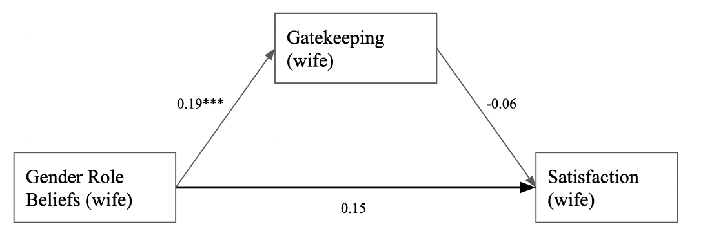

```{r analysis-preferences}
# Seed for random number generation
set.seed(42)
knitr::opts_chunk$set(cache.extra = knitr::rand_seed)
knitr::opts_chunk$set(include = FALSE)
```

```{r}
library(tidyverse)
library(nlme)
library(dplyr)
library(ggplot2)
library(rstatix)
library(bda)

```

```{r, include = FALSE}
dat_reverse <- read.csv("dat_reverse.csv")
dat_predyad <- read.csv("predyaddata.csv")
dat_dyad <- read.csv("dyadic.csv")
dat <- read.csv("TeleCom_Dyad_premeasures.csv")
```

# Results
## Analysis Strategy  
p~all~
To test our hypotheses that gender role beliefs and religion moderate the relationship between housework distribution and satisfaction, we used multilevel modeling and the Actor-Partner Interdependence Model [@kenny2020dyadic)]. The APIM measures the effect of the explanatory variables for both members in a dyad at the same time, so actor as well as partner effects could be considered in our analysis. This way, it is possible to see how one partner's housework distribution affects both their own satisfaction with the housework distribution (actor effect) and their partner's satisfaction with the housework distribution (partner effect). In this analysis, we will look at the moderating effect of each partner's gender role beliefs on the two actor effects (shown in figure 1) as well as on the partner effects.Our research studied people in relationships, where each pair in a relationship is refered to as a dyad. Since we were working with dyadic data, our data was not independent. For example the amount of housework one partner does, will be correlated with how much housework the other partner does.This will result in correlated residuals. To account for the nonindependence, the APIM considered how much of the variation in satisfaction was caused by the dyad compared to housework distribution and gender role beleifs. To account for the correlated errors, we weighted each dyad so that the residuals of each individual were constant.

(ref:my-figure-caption) Schematic representation of actor and partner effects in the APIM moderated by gender role beliefs.

```{r, fig.cap = "(ref:my-figure-caption)", include=TRUE}
knitr::include_graphics("APIM.png")
```

```{r, include=FALSE}
## centering moderator and predictor
## calculate difference between each individual's score and the grand mean of the entire sample
dat_dyad <- dat_dyad %>%
  mutate(
    Cavg_housework_female_A =  avg_housework_female_A- mean(avg_housework_female_A, na.rm = TRUE),
    Cavg_housework_female_P =  avg_housework_female_P- mean(avg_housework_female_P, na.rm = TRUE),
    Cavg_grbs_A =  avg_grbs_A- mean(avg_grbs_A, na.rm = TRUE),
    Cavg_grbs_P =  avg_grbs_P- mean(avg_grbs_P, na.rm = TRUE),
    Cavg_gate_A =  avg_gatekeeping_A - mean(avg_gatekeeping_A, na.rm=TRUE),
    Cavg_gate_P = avg_gatekeeping_P - mean(avg_gatekeeping_P, na.rm=TRUE),
    religionYN_A = ifelse((religion_A == "Athiest"| religion_A =="Agnostic"),"N","Y"),
    religionYN_P = ifelse((religion_P == "Athiest"|religion_A == "Agnostic"), "N","Y"),
    grbs_hl_A = ifelse(avg_grbs_A > mean(avg_grbs_A, na.rm = TRUE),"High","Low"),
    grbs_hl_P = ifelse(avg_grbs_P > mean(avg_grbs_P, na.rm = TRUE),"High","Low"))
```

```{r, include=FALSE}
## just the actor partner effects no moderation
basic_mod<- gls(housework_satisfied_A~as.factor(genderE_A)+
                    Cavg_housework_female_A:as.factor(genderE_A)+
                    Cavg_housework_female_P:as.factor(genderE_A),
                  data = dat_dyad,
                  correlation = corCompSymm(form=~1|dyadID), 
                  weights = varIdent(form=~1|as.factor(genderE_A)), 
                  na.action = na.omit)
summary(basic_mod)


# The summary table above is just of the actor partner effects with no moderation. The only relationship that is statistically significant is the one between the wife's satisfaction level and her average housework. We know this because the p-value for `as.factor(genderE_A)1:Cavg_housework_female_A` is 0.0041, which is less than 0.05. Since the value for this relationship is -0.029132, it signifies that as the wife's average housework increases, her satisfaction level decreases.
```

```{r, include=FALSE}
## two intercept model gives us the two coefficients for men and women
## this model removes the grand mean so we are only left with actor/partner  
## effects using grbs and gender as a moderator
## we don't need every single combination as an interaction term, so we only 
## kept the ones that we are interested in and haven't already calculated. 
## by removing extra parameters we will get more accurate estimates.
two_int_mod<- gls(housework_satisfied_A~as.factor(genderE_A)+
                    Cavg_housework_female_A:as.factor(genderE_A)+
                    Cavg_housework_female_P:as.factor(genderE_A)+
                    Cavg_grbs_A:as.factor(genderE_A)+
                    Cavg_grbs_P:as.factor(genderE_A)+
                    Cavg_housework_female_A:Cavg_grbs_A:as.factor(genderE_A)+
                    Cavg_housework_female_P:Cavg_grbs_P:as.factor(genderE_A)+
                    Cavg_housework_female_A:Cavg_grbs_P:as.factor(genderE_A)+
                    Cavg_housework_female_P:Cavg_grbs_A:as.factor(genderE_A) -1,
                    data = dat_dyad,
                    correlation = corCompSymm(form=~1|dyadID), 
                    weights = varIdent(form=~1|as.factor(genderE_A) ), 
                    na.action = na.omit)
coef(summary(two_int_mod))

```

```{r, include=FALSE}
#as.factor(genderE_A)0:Cavg_housework_female_A:Cavg_grbs_P = For men, keeping their average female-typed housework tasks constant, for every one unit increase in avg grbs, their housework satisfaction increases by 0.02. 
```

```{r, include=FALSE}
hd_grbA_p_val<-p_format(coef(summary(two_int_mod))[12,4],accuracy = .01)
```
## Main Results
#### Gender Role Beliefs
All relevant results of the moderation analysis in the APIM are shown in figure 2. It was shown that for husbands and wives, a higher amount of housework was significantly related to a lower satisfaction. For wives we found $\beta$ =`r coef(summary(two_int_mod))[3,1]`, *p* = `r coef(summary(two_int_mod))[3,4]`, and  *se* =`r coef(summary(two_int_mod))[3,2]`. For husbands we found b =`r coef(summary(two_int_mod))[4,1]`, *p* = `r coef(summary(two_int_mod))[4,4]` and *se* = `r coef(summary(two_int_mod))[4,2]`.
For the female partners, their own gender role beliefs significantly moderated the relationship between their housework distribution and their satisfaction with the housework distribution. The moderation effect was `r coef(summary(two_int_mod))[12,1]` (*p* = `r hd_grbA_p_val`, *se* = `r coef(summary(two_int_mod))[12,2]`). When the wives had higher gender role beliefs, which means more conservative, their satisfaction with the housework distribution tended to be higher, while keeping their own housework distribution constant at the mean. The husband's gender role beliefs significantly moderated the relationship between the wife's housework distribution and the wife's satisfaction with the housework distribution. The moderation effect was `r coef(summary(two_int_mod))[16,1]` (*p* = `r coef(summary(two_int_mod))[16,4]`, *se* = `r coef(summary(two_int_mod))[16,2]`). When the husbands had more conservative gender role beliefs, the wife's satisfaction decreased by `r coef(summary(two_int_mod))[16,1]` while keeping the wives housework distribution constant at the mean. Moreover, a marginally significant moderation effect was found for the relationship between the husbands amount of housework and the wife's satisfaction which was moderated by the wife's gender role beliefs (b = `r coef(summary(two_int_mod))[18,1]`, *p* =`r coef(summary(two_int_mod))[18,4]`, *se* = `r coef(summary(two_int_mod))[18,2]`). When wives had more conservative gender role beliefs, their satisfaction tended to be higher, while their husbands housework distribution was held constant at the mean.


(ref:my-figure-caption1) Moderation effects in the APIM. Values shown in the figure are b coefficients. 
* *p* < .05, ** *p* < .01, *** *p* < .001. 

```{r, fig.cap = "(ref:my-figure-caption1)", include=TRUE}
knitr::include_graphics("moderation.png")
```

```{r, include=FALSE}
#Looking at the summary table above, these are the relationships that are statistically significant:
#as.factor(genderE_A)1:Cavg_housework_female_A:Cavg_grbs_P, 8.742833e-03
#as.factor(genderE_A)1:Cavg_housework_female_A:Cavg_grbs_A, 8.408625e-04
#as.factor(genderE_A)0:Cavg_housework_female_A, 2.259373e-02
```

```{r, include=FALSE}
wives <- dat_dyad %>%
  filter(genderE_A == 1)%>%
  filter(grbs_hl_P == "High"|grbs_hl_P =="Low")
```

(ref:my-figure-caption2) Moderation of wife's housework distribution and satisfaction by gender role beliefs. Housework distribution in %, Satisfaction and gender role beliefs were measured with a 5 point Likert scale (1 = liberal, 5 = conservative).

```{r,include = TRUE,fig.cap = "(ref:my-figure-caption2)",fig.width=8,fig.height=4,fig.cap=}
wife_plot <- ggplot(wives, aes(
                x = avg_housework_female_A,
                y = housework_satisfied_A, 
                color = grbs_hl_A,  na.rm = TRUE)
                )+
  geom_point(na.rm = TRUE)+
  geom_smooth(method = "lm")+
  xlab("Housework Distribution (Wife)")+
  ylab("Satisfaction (Wife)")+
  scale_x_continuous(breaks = c(20, 40, 60,80,100), labels = c('up to 20%', 'up to 40%', 'up to 60%','up to 80%','up to 100%'))+
  labs(title ="Moderation of Wife's Housework Distribution and Satisfaction \n by Gender Role Beliefs",color = "Gender Role Beliefs \n (Wife)")+
  theme_bw()
  #theme(text = element_text(family = "Times New Roman"),
          #axis.title = element_text(size=12), 
          #axis.text = element_text(size=10),
          #legend.title= element_text(size=12),
         # legend.text = element_text(size=10),
          #strip.text = element_text(size=12))
  
  #ggtitle("Relationship of wife's housework distribution and gender role beliefs")#+
  #theme(text=element_text( family="TT Times New Roman", size=16))

  #ggtitle("Relationship of wive's housework distribution and gender role beliefs")
 #theme(text=element_text(size=12, family="Tinos"))
  #apa_theme()

wife_plot
```

(ref:my-figure-caption3) Moderation of wife's housework distribution and her satisfaction by their husbands gender role beliefs. Housework distribution in %, Satisfaction and gender role beliefs were measured with a 5 point Likert scale (1 = liberal, 5 = conservative).


```{r,include = TRUE,fig.cap = "(ref:my-figure-caption3)",fig.width=6,fig.height=3}
wife_plot2<- ggplot(wives, aes(
                x = avg_housework_female_A,
                y = housework_satisfied_A, 
                color = grbs_hl_P, na.rm = TRUE)
                )+
  geom_point(na.rm = TRUE)+
  geom_smooth(method = "lm")+
  scale_x_continuous(breaks = c(20, 40, 60,80,100), labels = c('up to 20%', 'up to 40%', 'up to 60%','up to 80%','up to 100%'))+
  labs(x = "Housework Distribution (Wife)", y = "Satisfaction (Wife)", title ="Moderation of Wife's Housework Distribution and her Satisfaction by \n her Husbands Gender Role Beliefs",color = "Gender Role Beliefs \n (Husband)")+
  theme_bw()
 # theme(text = element_text(family = "Times New Roman"),
         # axis.title = element_text(size=12), 
         # axis.text = element_text(size=10),
         # legend.title= element_text(size=12),
         # legend.text = element_text(size=10),
         # strip.text = element_text(size=12))
  #scale_color_brewer(palette = "Set1") 
  #theme_apa(box = TRUE) 
  #theme(legend.position = c(0.2, 0.8))

  #labs(x = "housework distribution", y = "Satisfaction", title = "Interaction of wives housework distribution and their husbands gender role beliefs") 
  

wife_plot2
```
```{r, include=FALSE}
# moderation approach
# moderation approach lets us know the difference between gender coefficients. 
# are the coefficients for men and women statistically different.
## check for gender interactions
mod<- gls(housework_satisfied_A ~ 
                Cavg_housework_female_A*Cavg_grbs_A*genderE_A +
                Cavg_housework_female_A*Cavg_grbs_P*genderE_A+
                Cavg_housework_female_P*Cavg_grbs_A*genderE_A +
                Cavg_housework_female_P*Cavg_grbs_P*genderE_A,
                    data = dat_dyad,
                    correlation = corCompSymm(form=~1|dyadID), 
                    weights = varIdent(form=~1|genderE_A), 
                    na.action = na.omit)

coef(summary(mod))
```

```{r, include = TRUE}
wife_plot<- ggplot(wives,aes(
                x = avg_housework_female_A,
                y = housework_satisfied_A, color = grbs_hl_A))

#(ref:my-figure-caption1) caption for graph
``` 


```{r}
wife_plot2<- ggplot(wives,aes(
                x = avg_housework_female_A,
                y = housework_satisfied_A, color = grbs_hl_P))
```

Wives who have low gender role beliefs, which means they are more liberal, reported a lower satisfaction with an increasing amount of housework they had to do. Women with more conservative gender role beliefs (high value) did not show a significant decrease in satisfaction with an increasing amount of housework (figure 3). 

As the the amount of housework increases for wives whose husbands have low gender role beliefs, their satisfaction remains constant. When housework increases for wives whose husbands have high gender role beliefs, their satisfaction decreases (figure 4).
Since we used distinguishable dyads, gender was a built in moderator. To see if the moderation effects differed significantly by gender, we looked at the three way interactions between gender, housework distribution, and gender role beliefs. We found two significant gender differences in the moderation effects. The interaction between the actor's housework and their own gender role beliefs was significantly different for husbands and wives with an estimate of `r coef(summary(mod))[15,1]` (*p* = `r coef(summary(mod))[15,4]`, *se* = `r coef(summary(mod))[15,2]`). The moderation effect of ones own gender role beliefs was `r coef(summary(mod))[15,1]` units higher for women than men, meaning the moderation effect of gender role beliefs had a significantly larger positive effect on satisfaction for wives than for husbands. 
In addition, the interaction between the actor's amount of housework and their partners gender role beliefs was significantly different for husbands and wives with an estimate of `r coef(summary(mod))[16,1]`(*p* = `r coef(summary(mod))[16,4]`, *se* = `r coef(summary(mod))[16,2]`).The moderation effect of the partners gender role beliefs was `r coef(summary(mod))[16,1]` units lower for women than men which means that the moderation effect of the husbands gender role beliefs had a significantly larger negative effect on satisfaction compared to how the wifes gender role beliefs effected the relationship between housework distribution and satisfaction for her husband.

#### Religion
```{r}
## two intercept model
#this model removes the grand mean
## using religion and gender as  moderators
two_int_mod_religion<- gls(housework_satisfied_A~as.factor(genderE_A)+
                    Cavg_housework_female_A:as.factor(genderE_A)+
                    Cavg_housework_female_P:as.factor(genderE_A)+
                    religionYN_A:as.factor(genderE_A)+
                    #religionYN_P:as.factor(genderE_A)+
                    Cavg_housework_female_A:religionYN_A:as.factor(genderE_A)+
                    Cavg_housework_female_P:religionYN_P:as.factor(genderE_A)+
                    Cavg_housework_female_A:religionYN_P:as.factor(genderE_A)+
                    Cavg_housework_female_P:religionYN_A:as.factor(genderE_A) -1,
                    data = dat_dyad,
                    correlation = corCompSymm(form=~1|dyadID), 
                    weights = varIdent(form=~1|as.factor(genderE_A) ), 
                    na.action = na.omit)
coef(summary(two_int_mod_religion))
```

No significant relationships between any of the variables have been found in the APIM model including the moderator religion (*p* > `r coef(summary(two_int_mod_religion))[16,4]`). Religion did therefore not moderate the relationship between housework distribution and satisfaction for wives and husbands. 


```{r}
# moderation approach
# check for gender interactions
 int_mod_religion<- gls(housework_satisfied_A ~
                       Cavg_housework_female_A*religionYN_A*genderE_A+
                       # Cavg_housework_female_A*religionYN_P*genderE_A+
                       Cavg_housework_female_P*religionYN_A*genderE_A,
                       # Cavg_housework_female_P*religionYN_P*genderE_A,
                    data = dat_dyad,
                    correlation = corCompSymm(form=~1|dyadID), 
                    weights = varIdent(form=~1|genderE_A), 
                    na.action = na.omit)

coef(summary(int_mod_religion))
```


## Exploratory Results
In order to being able to find possible explanations for the association between gender role beliefs and satisfaction that we found in our analysis, we conducted a simple mediation analysis, investigating whether the wife's gatekeeping mediated the relationship between her gender role beliefs and her satisfaction, and therefore could explain the patterns found in the prior analysis. Are women with higher gender role beliefs more likely to gatekeep housework tasks which would in turn lead to a higher satisfaction?
Linear models will be calculated for all paths to see whether all paths are significant first, before we will calculate the mediation effect in a second step.

(ref:my-figure-caption5) Proposed mediation model with wife's gatekeeping as the mediator of the wife's gender role beliefs and satisfaction. Values shown in the figure are b coefficients. 
* *p* < .05, ** *p* < .01, *** *p* < .001. 

```{r, fig.cap = "(ref:my-figure-caption5)", include=TRUE}

```

As seen in figure 5, no significant relationship between gender role beliefs and satisfaction has been found, despite the moderating effect of gender role beliefs that has been found before. Because only the relationship between gender role beliefs and gatekeeping has been significant, a full mediation analysis was no longer appropriate to conduct. 
Instead, we conducted post-hoc t tests to get a better sense of the relationship between gender role beliefs and gatekeeping. INCLUDE T TESTS HERE. 


```{r, include=FALSE}
##Step 1: Estimating and testing the total effect (c) of grbs (X) on Satisfaction (Y)
apim_stp1 <- gls(housework_satisfied_A ~ genderE_A + avg_grbs_A:genderE_A + avg_grbs_P:genderE_A - 1,
                 data = dat_dyad,
                 correlation = corCompSymm(form=~1|dyadID), 
                 weights = varIdent(form=~1|genderE_A), 
                 na.action = na.omit)

summary(apim_stp1)

```

```{r}
p_val<-p_format(coef(summary(apim_stp1))[2,4],accuracy = .01)
```

```{r, include=FALSE}
#The summary table above shows us that all paths are statistically significant (*p* `r p_val`). Not all the paths are positive, the effect of the partner gender role beliefs on the actor's satisfaction is negative. So, the partner's gender role beliefs could negatively impact the actor's satisfaction. The effect of the actor's gender role beliefs on the actor's satisfaction is `r coef(summary(apim_stp1))[2,1]` which means that the actor's gender role beliefs could positively impact the actor's satisfaction.
```

```{r}
library(tidyverse)
library(psych)
library(lubridate)
dat_dyad_f <- filter(dat_dyad,genderE_A == 1)
model1 <- lm (housework_satisfied_A ~ avg_grbs_A, dat_dyad)
summary(model1)
```

```{r, include=FALSE}
#The summary table above shows us that all paths are statistically significant (*p*<=`r coef(summary(apim_stp1))[2,4]`). Not all the paths are positive, the effect of the partner gender role beliefs on the actor's satisfaction is negative. So, the partner's gender role beliefs could negatively impact the actor's satisfaction. The effect of the actor's gender role beliefs on the actor's satisfaction is `r coef(summary(apim_stp1))[2,1]` which means that the actor's gender role beliefs could positively impact the actor's satisfaction.
```


```{r, include=FALSE}
#### Interpretation: 

#All four paths are positive and statistically significant: Seeing your partner positively leads you and your partner to be more satisfied.  All four of these paths could potentially be mediated.
```

```{r, include=FALSE}
###Step 2: Testing the effects of the grbs (X) on the mediators of Wife and Husband gatekeeping (M).
apim_stp2 <- gls(avg_gatekeeping_A ~ genderE_A + avg_grbs_A:genderE_A + avg_grbs_P:genderE_A - 1,
                 data = dat_dyad,
                 correlation = corCompSymm(form=~1|dyadID), 
                 weights = varIdent(form=~1|genderE_A), 
                 na.action = na.omit)

summary(apim_stp2)
model2 <- lm (housework_satisfied_A ~ avg_gatekeeping_A, dat_dyad)
summary(model2)
```
```{r, include=FALSE}
#The summary table above shows us that not all paths are statistically significant. The effect of the actor's gender role beliefs on the actor's gatekeeping behaviors could be potentially mediated (*p* =`r coef(summary(apim_stp2))[2,4]`). This path is also positive, so the actor's gender role beliefs could positively impact the actor's gatekeeping behaviors.
```

```{r}
p_val2<-p_format(coef(summary(apim_stp2))[2,4],accuracy = .01)
p_val2
```

```{r, include=FALSE}

#The summary table above shows us that not all paths are statistically significant. The effect of the actor's gender role beliefs on the actor's gatekeeping behaviors could be potentially mediated (*p* =`r p_val2`). This path is also positive, so the actor's gender role beliefs could positively impact the actor's gatekeeping behaviors.
```

```{r, include=FALSE}
#### Interpretation: 
#All four paths of the "a" paths are negative and statistically significant: Seeing your partner positively leads you and your partner to have lower levels of tension.

### Steps 3 and 4: Testing the effects of the Tension (M) and Other Positivity (X) on the Satisfaction (Y). 
```

```{r}
apim_stp3 <- gls(housework_satisfied_A ~ genderE_A + avg_grbs_A:genderE_A + avg_grbs_P:genderE_A 
                 + avg_gatekeeping_A:genderE_A + avg_gatekeeping_P:genderE_A - 1,
                 data = dat_dyad,
                 correlation = corCompSymm(form=~1|dyadID), 
                 weights = varIdent(form=~1|genderE_A), 
                 na.action = na.omit)

summary(apim_stp3)
model3 <- lm (avg_grbs_A ~ avg_gatekeeping_A, dat_dyad)
summary(model3)
```

```{r, include=FALSE}
#I DONT UNDERSTAND WHAT A B PATH IS SO I CANT ADD MY ANALYSIS THIS THIS PART - DO EITHER OF YOU UNDERSTAND IT?(a path, the effect the explanatory variable has on the mediator, c path: the effect the explanatory had on the response. B path: the effect the mediator has on the response while controling for the explanatory variable. c` means the effect the explanatory variable has on the predictor after controling for the mediator. To find how much effect the mediator has, we do ab/c*100 )(in context of our study b path means the effect of gatekeeping on satisfaction while controlling for housework distribution.We need both a and b paths to claim mediation. )
```
```{r, include=FALSE}
#### Interpretation:    
#**Step 3**: All four "b" paths from Tension to Satisfaction are negative and three are statistically significant:  Seeing more tension in the relationship leads to less satisfaction for you and your partner, even after controlling for how positively you and your partner see each other. The one effect that is not statistically significant is the effect of male's level of tension on his wife's level of satisfaction.   

#**Step 4**: All paths from Other Positivity to Satisfaction, the direct of c', are positive and statistically significant: Seeing your partner positively leads you and your partner to have higher levels of satisfaction, even after controlling for yours and your partner's tension.
```

```{r, include=FALSE}
female_gatekeeping <- dat_dyad %>%
  dplyr::filter(genderE_A == 1)

mediation.test(female_gatekeeping$avg_gatekeeping_A, female_gatekeeping$avg_grbs_A, female_gatekeeping$housework_satisfied_A)
```

```{r, include=FALSE}
#The Sobel test measures whether gatekeeping influences how the female partner's gender role beliefs affects her satisfaction. Looking at the p-value from results table above, the data are not statistic. Gatekeeping doesn't have a significant influence on this relationship.
```

```{r, include=FALSE}
dat_dyad
dat_dyad_relY <-filter(dat_dyad, religionYN_A == "Y")
dat_dyad_relN <-filter(dat_dyad, religionYN_A == "N")

t.test(dat_dyad_relY$avg_grbs_A, dat_dyad_relN$avg_grbs_A)

dat_highgrbs<-filter(dat_dyad, dat_dyad$grbs_hl_A == "High")
dat_lowgrbs<-filter(dat_dyad, dat_dyad$grbs_hl_A == "Low")
gate_t_test<- t.test(dat_lowgrbs$avg_grbs_A, dat_highgrbs$avg_grbs_A)
mean(dat_highgrbs$avg_gatekeeping_A, na.rm=TRUE)
mean(dat_lowgrbs$avg_gatekeeping_A, na.rm = TRUE)

```

```{r}
gate_t_test
```

```{r}
t_test_p_val <-p_format(gate_t_test$p.val, accuracy = .01)
t_test_p_val
```


After running a t-test to examine the difference in gatekeeping behaviors between women with high gender role beleifs and women with low gender role beleifs we found a t-statistic of `r gate_t_test$statistic` with a p-value of `r t_test_p_val`. 

# References
::: {#refs custom-style="Bibliography"}
:::


