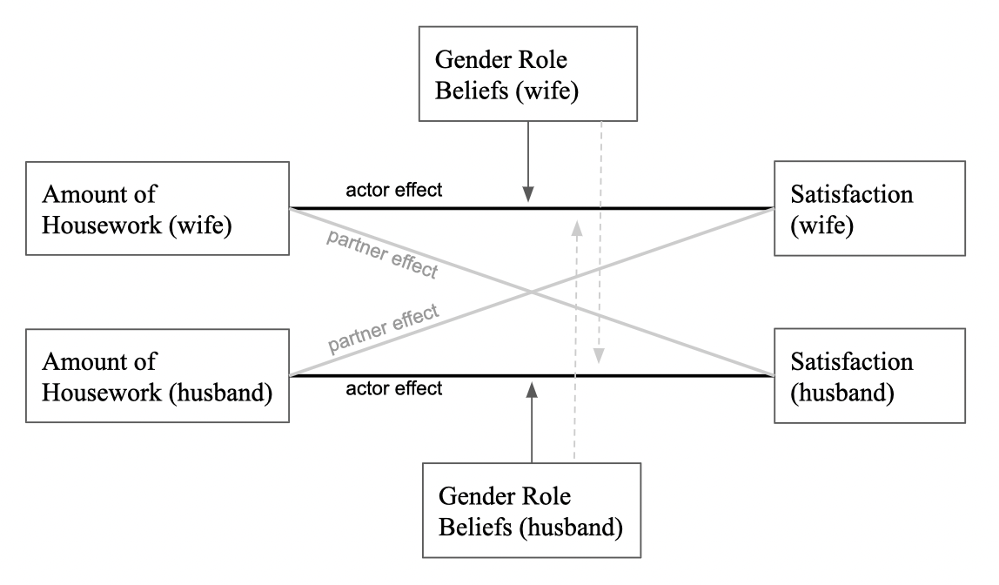
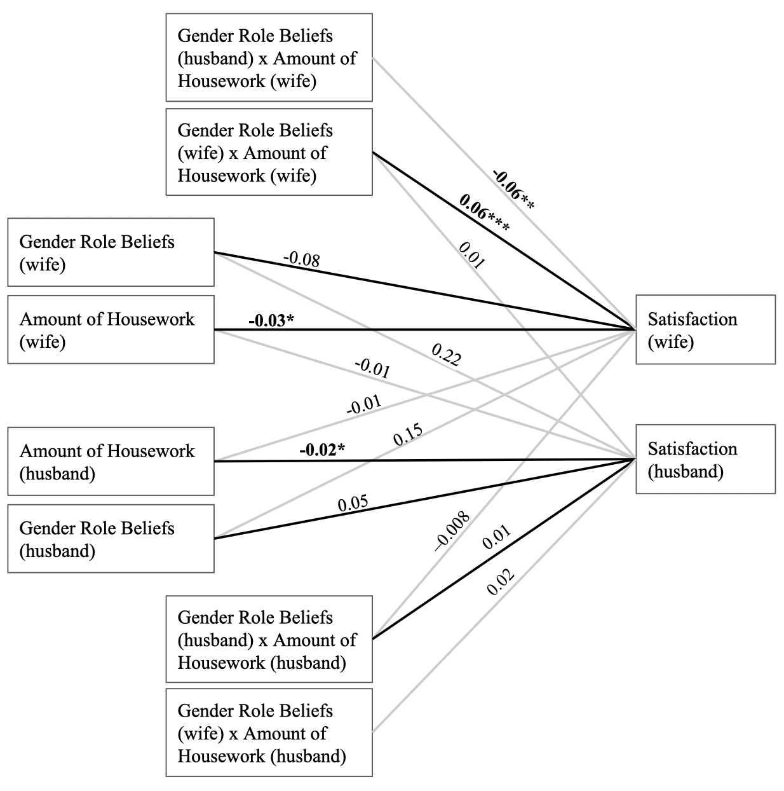

```{r analysis-preferences}
# Seed for random number generation
set.seed(42)
knitr::opts_chunk$set(cache.extra = knitr::rand_seed)
knitr::opts_chunk$set(include = FALSE)
```

```{r}
library(tidyverse)
library(nlme)
library(dplyr)
library(ggplot2)
library(rstatix)
library(bda)
```

```{r, include = FALSE}
dat_reverse <- read.csv("dat_reverse.csv")
dat_predyad <- read.csv("predyaddata.csv")
dat_dyad <- read.csv("dyadic.csv")
dat <- read.csv("TeleCom_Dyad_premeasures.csv")
head(dat_dyad)
```
# Results

## Analysis Strategy  

To test our hypotheses that gender role beliefs and religion moderate the relationship between housework distribution and satisfaction, we used multilevel modeling and the Actor-Partner Interdependence Model (APIM; Kenny, Kashy, & Cook, 2006). The APIM measures the effect of the explanatory variables for both members in a dyad at the same time, so actor as well as partner effects could be considered in our analysis. This way, it is possible to see how one partner's housework distribution effects both their own satisfaction with the housework distribution (actor effect) and their partner's satisfaction with the housework distribution (partner effect). In this analysis, we will further look at the moderating effect of each partner's gender role beliefs on the two actor effects (shown in figure 1) as well as on the partner effects. (THIS FOLLOWING SENTENCE CONFUSES ME!) The APIM measures proportion of variance in satisfaction that occurs between dyads vs. the total variation present. In other words, the model considers how much of the variation in satisfaction is caused by the dyad. This allows to estimate satisfaction with the distribution of housework as a function of both housework distribution and the the random errors at both the individual and dyad level. This accounts for the non-independent data. 

(ref:my-figure-caption) Actor Partner Effects in the APIM.

```{r, fig.cap = "(ref:my-figure-caption)", include=TRUE}

```

## Main Results

### Gender Role Beliefs as a mediator 

```{r, include=FALSE}
## centering moderator and predictor
## calculate difference btw each individuals score and the grand mean of the entire sample
dat_dyad <- dat_dyad %>%
  mutate(
    Cavg_housework_female_A =  avg_housework_female_A- mean(avg_housework_female_A, na.rm = TRUE),
    Cavg_housework_female_P =  avg_housework_female_P- mean(avg_housework_female_P, na.rm = TRUE),
    Cavg_grbs_A =  avg_grbs_A- mean(avg_grbs_A, na.rm = TRUE),
    Cavg_grbs_P =  avg_grbs_P- mean(avg_grbs_P, na.rm = TRUE),
    Cavg_gate_A =  avg_gatekeeping_A - mean(avg_gatekeeping_A, na.rm=TRUE),
    Cavg_gate_P = avg_gatekeeping_P - mean(avg_gatekeeping_P, na.rm=TRUE),
    religionYN_A = ifelse((religion_A == "Athiest"| religion_A =="Agnostic"),"N","Y"),
    religionYN_P = ifelse((religion_P == "Athiest"|religion_A == "Agnostic"), "N","Y"),
    grbs_hl_A = ifelse(avg_grbs_A > mean(avg_grbs_A, na.rm = TRUE),"High","Low"),
    grbs_hl_P = ifelse(avg_grbs_P > mean(avg_grbs_P, na.rm = TRUE),"High","Low"))
```


```{r, include=FALSE}
## just the actor partner effects no moderation
basic_mod<- gls(housework_satisfied_A~as.factor(genderE_A)+
                    Cavg_housework_female_A:as.factor(genderE_A)+
                    Cavg_housework_female_P:as.factor(genderE_A),
                  data = dat_dyad,
                  correlation = corCompSymm(form=~1|dyadID), 
                  weights = varIdent(form=~1|as.factor(genderE_A)), 
                  na.action = na.omit)
summary(basic_mod)


#The summary table above is just of the actor partner effects with no moderation. The only relationship that is statistically significant is the one between the wife's satisfaction level and her average housework. We know this because the p-value for `as.factor(genderE_A)1:Cavg_housework_female_A` is 0.0041, which is less than 0.05. Since the value for this relationship is -0.029132, it signifies that as the wife's average housework increases, her satisfaction level decreases.
```

```{r, include=FALSE}
## two intercept model gives us the two coefficients for men and women
## this model removes the grand mean so we are only left with actor/partner  
## effects using grbs and gender as a moderator
## we don't need every single combination as an interaction term, so we only 
## kept the ones that we are interested in and haven't already calculated. 
## by removing extra parameters we will get more accurate estimates.
two_int_mod<- gls(housework_satisfied_A~as.factor(genderE_A)+
                    Cavg_housework_female_A:as.factor(genderE_A)+
                    Cavg_housework_female_P:as.factor(genderE_A)+
                    Cavg_grbs_A:as.factor(genderE_A)+
                    Cavg_grbs_P:as.factor(genderE_A)+
                    Cavg_housework_female_A:Cavg_grbs_A:as.factor(genderE_A)+
                    Cavg_housework_female_P:Cavg_grbs_P:as.factor(genderE_A)+
                    Cavg_housework_female_A:Cavg_grbs_P:as.factor(genderE_A)+
                    Cavg_housework_female_P:Cavg_grbs_A:as.factor(genderE_A) -1,
                    data = dat_dyad,
                    correlation = corCompSymm(form=~1|dyadID), 
                    weights = varIdent(form=~1|as.factor(genderE_A) ), 
                    na.action = na.omit)

coef(summary(two_int_mod))
```

```{r, include=FALSE}
#as.factor(genderE_A)0:Cavg_housework_female_A:Cavg_grbs_P = For men, keeping their average female-typed housework tasks constant, for every one unit increase in avg grbs, their housework satisfaction increases by 0.02. 
```

```{r, include=FALSE}
#hd_grbA_p_val<-p_format(coef(summary(two_int_mod))[12,4],accuracy = .05)
```

For women, gender role beliefs significantly moderated the relationship between her own housework distribution and her satisfaction with the housework distribution. The moderation effect was `r coef(summary(two_int_mod))[12,1]` (*p* = `r coef(summary(two_int_mod))[12,4]`, *se* = `r coef(summary(two_int_mod))[12,2]`). For every one unit increase in her gender role beliefs, her satisfaction increases by `r two_int_mod$coefficients[12]` while keeping housework distribution constant. Again for women, her partners gender role beliefs significantly moderated the relationship between her own housework distribution and her satisfaction with the housework distribution. The moderation effect was `r coef(summary(two_int_mod))[16,1]` (*p* = `r coef(summary(two_int_mod))[16,4]`,se = `r coef(summary(two_int_mod))[16,2]`). For every one unit increase in her partners gender role beliefs, her own satisfaction increased by `r coef(summary(two_int_mod))[16,1]` while keeping housework distribution constant.

(ref:my-figure-caption1) Moderation effects in the APIM.

```{r, fig.cap = "(ref:my-figure-caption1)", include=TRUE}

```

Looking at the summary table above, these are the relationships that are statistically significant:
as.factor(genderE_A)1:Cavg_housework_female_A:Cavg_grbs_P, 8.742833e-03
as.factor(genderE_A)1:Cavg_housework_female_A:Cavg_grbs_A, 8.408625e-04
as.factor(genderE_A)0:Cavg_housework_female_A, 2.259373e-02

```{r, include=FALSE}
# moderation approach
# moderation approach lets us know the difference between gender coefficients. 
# are the coefficients for men and women statistically different.
## check for gender interactions
mod<- gls(housework_satisfied_A ~ 
                Cavg_housework_female_A*Cavg_grbs_A*genderE_A +
                Cavg_housework_female_A*Cavg_grbs_P*genderE_A+
                Cavg_housework_female_P*Cavg_grbs_A*genderE_A +
                Cavg_housework_female_P*Cavg_grbs_P*genderE_A,
                    data = dat_dyad,
                    correlation = corCompSymm(form=~1|dyadID), 
                    weights = varIdent(form=~1|genderE_A), 
                    na.action = na.omit)

coef(summary(mod))
```

Only looking at the three way interactions with gender we found two significant gender differences in the moderation effects. The interaction between actors housework distribution and their own gender role beliefs was significantly different for husbands and wives with an estimate of `r coef(summary(mod))[15,1]` (*p*=`r coef(summary(mod))[15,4]`,*se*=`r coef(summary(mod))[15,2]`). The moderation effect of ones own gender role beliefs was `r coef(summary(mod))[15,1]` units higher for women than men meaning the moderation effect of gender role beliefs had a significantly larger positive effect on satisfaction for wives than for husbands. 

In addition the interaction between actors housework distribution and their partners gender role beliefs was significantly different for husbands and wives with an estimate of `r coef(summary(mod))[16,1]`(*p*=`r coef(summary(mod))[16,4]`,*se* = `r coef(summary(mod))[16,2]`).The moderation effect of ones partners gender role beliefs was `r coef(summary(mod))[16,1]` units lower for women than men meaning the moderation effect of her husbands gender role beliefs had a significantly larger negative effect on satisfaction compared to how her gender role beliefs effected the relationship between housework distribution and satisfaction for her husband. 


```{r, include=FALSE}
wives <- dat_dyad %>%
  filter(genderE_A == 1)%>%
  filter(grbs_hl_P == "High"|grbs_hl_P =="Low")
```

```{r, include = TRUE}
wife_plot<- ggplot(wives,aes(
                x = avg_housework_female_A,
                y = housework_satisfied_A, color = grbs_hl_A))

#(ref:my-figure-caption1) caption for graph
``` 

```
wife_plot<- ggplot(wives,aes(
                x = avg_housework_female_A,
                y = housework_satisfied_A, 
                color = grbs_hl_A,  na.rm = TRUE)
                )+
  geom_point(na.rm = TRUE)+
  geom_smooth(method = "lm")+
  labs(x = "Housework distribution", y = "Satisfaction", title ="Relationship of wive's housework distribution and gender role beliefs")
```

(ref:my-figure-caption2) caption for graph

```{r, include = TRUE,fig.cap = "(ref:my-figure-caption2)"}
wife_plot <- ggplot(wives,aes(
                x = avg_housework_female_A,
                y = housework_satisfied_A, 
                color = grbs_hl_A,  na.rm = TRUE)
                )+
  geom_point(na.rm = TRUE)+
  geom_smooth(method = "lm")+
  xlab("Housework distribution")+
  ylab("Satisfaction")+

  ggtitle("Relationship of wive's housework distribution and gender role beliefs")#+
  #theme(text=element_text( family="TT Times New Roman", size=16))

  ggtitle("Relationship of wive's housework distribution and gender role beliefs")
  #theme(text=element_text(size=16, 
       #family="TT Times New Roman"))
  #apa_theme()

wife_plot
```


(ref:my-figure-caption3) caption for graph
```{r}
wife_plot2<- ggplot(wives,aes(
                x = avg_housework_female_A,
                y = housework_satisfied_A, color = grbs_hl_P))
```
As the housework distribution increases for wives with low gender role beliefs, their satisfaction decreases. This makes sense because wives with low gender role beliefs would believe in an equal housework distribution where she wasn't doing majority of the housework tasks. As the housework distribution increases for wives with high gender role beliefs, their satisfaction has a very slight decrease, but it stays more or less the same.

```{r, include = TRUE,fig.cap = "(ref:my-figure-caption3)"}
wife_plot2<- ggplot(wives, aes(
                x = avg_housework_female_A,
                y = housework_satisfied_A, 
                color = grbs_hl_P, na.rm = TRUE)
                )+
  geom_point(na.rm = TRUE)+
  geom_smooth(method = "lm")+
  scale_x_continuous(breaks = c(20, 40, 60,80,100), labels = c('up to 20%', 'up to 40%', 'up to 60%','up to 80%','up to 100%'))+
  labs(x = "housework distribution", y = "Satisfaction", title ="Interaction of wives housework distribution and their husbands gender role beleifs",color = "Gender Role Beleifs")
  #scale_color_brewer(palette = "Set1") 
  #theme_apa(box = TRUE) 
  #theme(legend.position = c(0.2, 0.8))

  #labs(x = "housework distribution", y = "Satisfaction", title = "Interaction of wives housework distribution and their husbands gender role beleifs") 
  

wife_plot2
```

As the housework distribution increases for wives whose husbands have low gender role beliefs, their satisfaction remains constant. As the housework distribution increases for wives whose husbands have high gender role beliefs, their satisfaction decreases.


### Religion

```{r}
## two intercept model
#this model removes the grand mean
## using religion and gender as  moderators
two_int_mod_religion<- gls(housework_satisfied_A~as.factor(genderE_A)+
                    Cavg_housework_female_A:as.factor(genderE_A)+
                    Cavg_housework_female_P:as.factor(genderE_A)+
                    religionYN_A:as.factor(genderE_A)+
                    #religionYN_P:as.factor(genderE_A)+
                    Cavg_housework_female_A:religionYN_A:as.factor(genderE_A)+
                    Cavg_housework_female_P:religionYN_P:as.factor(genderE_A)+
                    Cavg_housework_female_A:religionYN_P:as.factor(genderE_A)+
                    Cavg_housework_female_P:religionYN_A:as.factor(genderE_A) -1,
                    data = dat_dyad,
                    correlation = corCompSymm(form=~1|dyadID), 
                    weights = varIdent(form=~1|as.factor(genderE_A) ), 
                    na.action = na.omit)
coef(summary(two_int_mod_religion))
```
The two intercept model gives us the two coefficients for men and women. 

None of the interactions between actors housework distribution and their religion was significantly different for husbands or wives. (*p*>=`r coef(summary(two_int_mod_religion))[16,4]`,*se*=`r coef(summary(two_int_mod_religion))[16,2]`). None of the results illustrate that the average female-typed tasks completed by the actor or partner from the husband and wife's perspective was related to their religion.


```{r}
# moderation approach
# check for gender interactions
 int_mod_religion<- gls(housework_satisfied_A ~
                       Cavg_housework_female_A*religionYN_A*genderE_A+
                       # Cavg_housework_female_A*religionYN_P*genderE_A+
                       Cavg_housework_female_P*religionYN_A*genderE_A,
                       # Cavg_housework_female_P*religionYN_P*genderE_A,
                    data = dat_dyad,
                    correlation = corCompSymm(form=~1|dyadID), 
                    weights = varIdent(form=~1|genderE_A), 
                    na.action = na.omit)

coef(summary(int_mod_religion))
```


## Exploratory Results

Mediation is a way for researchers to explain the process of one variable affecting another variable. It is essentially a possible explanation for the relationship between the two variables. Mediation assesses whether the effects of the X variable (the independent variable) are significant on the Y variable (the dependent variable), through a third variable called M (the mediator).

Based on our primary analysis so far, we are interested in further exploring how to concept of gatekeeping fits into our research. We want to explore whether gatekeeping is a mediator variable in our relationship between the partners' gender role beliefs and housework tasks. Are women with higher gender role beliefs more likely to gatekeep housework tasks?

```{r, include=FALSE}
library(tidyverse)
library(nlme)
dat_dyad
##Step 1: Estimating and testing the total effect (c) of grbs (X) on Satisfaction (Y)
apim_stp1 <- gls(housework_satisfied_A ~ genderE_A + avg_grbs_A:genderE_A + avg_grbs_P:genderE_A - 1,
                 data = dat_dyad,
                 correlation = corCompSymm(form=~1|dyadID), 
                 weights = varIdent(form=~1|genderE_A), 
                 na.action = na.omit)

summary(apim_stp1)

```

#### Interpretation: 

All four paths are positive and statistically significant: Seeing your partner positively leads you and your partner to be more satisfied.  All four of these paths could potentially be mediated.

###Step 2: Testing the effects of the grbs (X) on the mediators of Wife and Husband gatekeeping (M).

```{r}
dat_dyad
apim_stp2 <- gls(avg_gatekeeping_A ~ genderE_A + avg_grbs_A:genderE_A + avg_grbs_P:genderE_A - 1,
                 data = dat_dyad,
                 correlation = corCompSymm(form=~1|dyadID), 
                 weights = varIdent(form=~1|genderE_A), 
                 na.action = na.omit)

summary(apim_stp2)
```

#### Interpretation: 
All four paths of the "a" paths are negative and statistically significant: Seeing your partner positively leads you and your partner to have lower levels of tension.

### Steps 3 and 4: Testing the effects of the Tension (M) and Other Positivity (X) on the Satisfaction (Y). 

```{r}
apim_stp3 <- gls(housework_satisfied_A ~ genderE_A + avg_grbs_A:genderE_A + avg_grbs_P:genderE_A 
                 + avg_gatekeeping_A:genderE_A + avg_gatekeeping_P:genderE_A - 1,
                 data = dat_dyad,
                 correlation = corCompSymm(form=~1|dyadID), 
                 weights = varIdent(form=~1|genderE_A), 
                 na.action = na.omit)

summary(apim_stp3)
```


#### I didn't change anything from here on yet! 


#### Interpretation:    
**Step 3**: All four "b" paths from Tension to Satisfaction are negative and three are statistically significant:  Seeing more tension in the relationship leads to less satisfaction for you and your partner, even after controlling for how positively you and your partner see each other. The one effect that is not statistically significant is the effect of male's level of tension on his wife's level of satisfaction.   
**Step 4**: All paths from Other Positivity to Satisfaction, the direct of c', are positive and statistically significant: Seeing your partner positively leads you and your partner to have higher levels of satisfaction, even after controlling for yours and your partner's tension.

# Testing Indirect Effects Using Multilevel Modeling

  * Sobel Test
    + Save effect estimates and standard errors.
     - Compute Z test.
     - Low power.
  * Separately Test a and b
    + Old fashioned.
    + But may be making a comeback.
  * Bootstrapping
    + Difficult currently
    + See Pituch & Stapleton (Multivariate Behavioral Research, 2008) for a discussion of how to bootstrap in MLM.
    + Option available in some MLM programs. Only for effects but not indirect effects.
  * Monte Carlo Method
    + Appears to be the method of choice for MLMeM  

## Sobel Test

```{r}
# just for female partners

female_gatekeeping <- dat_dyad %>%
  dplyr::filter(genderE_A == 1)

mediation.test(female_gatekeeping$avg_gatekeeping_A, female_gatekeeping$avg_grbs_A, female_gatekeeping$housework_satisfied_A)
```

The Sobel test measures whether gatekeeping influences how the female partner's gender role beliefs affects her satisfaction. The p-value is 0.82, and since it is greater than 0.05, we can conclude that the results are not significant. Gatekeeping doesn't have a significant influence on this relationship.


## MCMAM [Selig & Preacher, 2008](http://www.quantpsy.org/medmc/medmc.htm)

```
# Function that returns mcmc CI. 
# mcmamCI <- function(aval, bval, varA, varB, n){

# code (Selig & Preacher, 2008).
  #require(MASS)
  
  a=aval
  b=bval
  rep=n
  conf=95
  pest=c(a,b)
  acov <- matrix(c(varA, 0, 0, varB),2,2)

  mcmc <- mvrnorm(rep,pest,acov,empirical=FALSE)

  ab <- mcmc[,1]*mcmc[,2]

  low=(1-conf/100)/2
  upp=((1-conf/100)/2)+(conf/100)

  LL=quantile(ab,low)
  UL=quantile(ab,upp)
  LL=format(LL,digits=3)
  UL=format(UL,digits=3)

  CI <- cbind.data.frame(LL, UL)
  return(CI)


```

For example, we can find the MCMC 95% CI for the **Actor-Actor: Husband** indirect effect like this.


act_H_a <- coef(summary(apim_stp2))[3,1]
act_H_a_se <- coef(summary(apim_stp2))[3,2]
act_H_b <- coef(summary(apim_stp3))[7,1]
act_H_b_se <- coef(summary(apim_stp3))[7,2]

mcmamCI(act_H_a, act_H_b, act_H_a_se^2, act_H_b_se^2, 3000)
#confidence intervals > does it include 0?

```

	
	
## Summary of Indirect Effects

|Name	|Indirect Effects	|Estim.|	p	|95% CI^a^ Lower|	Upper|
|:---:|:---------------:|:----:|:--:|:---:|:----:|
|Actor-Actor: W	|Xw -> Mw -> Yw|	0.165|	<.001|	0.086|	0.257|
|Actor-Actor: H	|Xh -> Mh -> Yh|	0.099|	<.001|	0.042|	0.172|
|Partner-Partner: W|	Xw -> Mh -> Yw|	0.027|	.090|	-0.003|	0.070|
|Partner-Partner: H|	Xh -> Mw -> Yh|	0.034|	.024|	0.003|	0.079|
|Actor-Partner: W|	Xh -> Mh -> Yw|	0.038|	.086|	-0.005|	0.092|
|Actor-Partner: H|	Xw -> Mw -> Yh|	0.060|	.004|	0.017|	0.115|
|Partner-Actor: W|	Xh -> Mw -> Yw|	0.094|	.023|	0.013|	0.186|
|Partner-Actor: H|	Xw -> Mh -> Yh|	0.072|	.003|	0.023|	0.134|

^a^Bootstrapped CI using MCM
(The above table was produced by an Excel spreadsheet: IndirectEffects.xls.)

## Summary Direct and Total Effects
|Name|	Direct Effects	|Direct|	p	|Total^a^|	% Mediated|
|:---:|:---------------:|:----:|:--:|:---:|:---:|
|Actor: Wife|	Xw ->  Yw |	0.185	| .007|	0.378|	50.9|
|Actor: Husband|	Xh ->  Yh |	0.291|	<.001|	0.424|	31.5|
|Partner: Wife|	Xh ->  Yw |	0.190|	.010|	0.321|	40.9|
|Partner: Husband|	Xw ->  Yh |	0.129|	.028|	0.262|	50.8|

^a^Computed as `ab + c'` and `c` with results agreeing.  

Note that `% Mediated` equals `ab/c` or equivalently `1 - c'/c`.  This value can be larger than one or negative.  First, make sure that `c` is substantial.  If it is, then if `% Mediated` is greater than 100 or negative, you have "inconsistent mediation":  the direct and indirect effects are of opposite signs.


